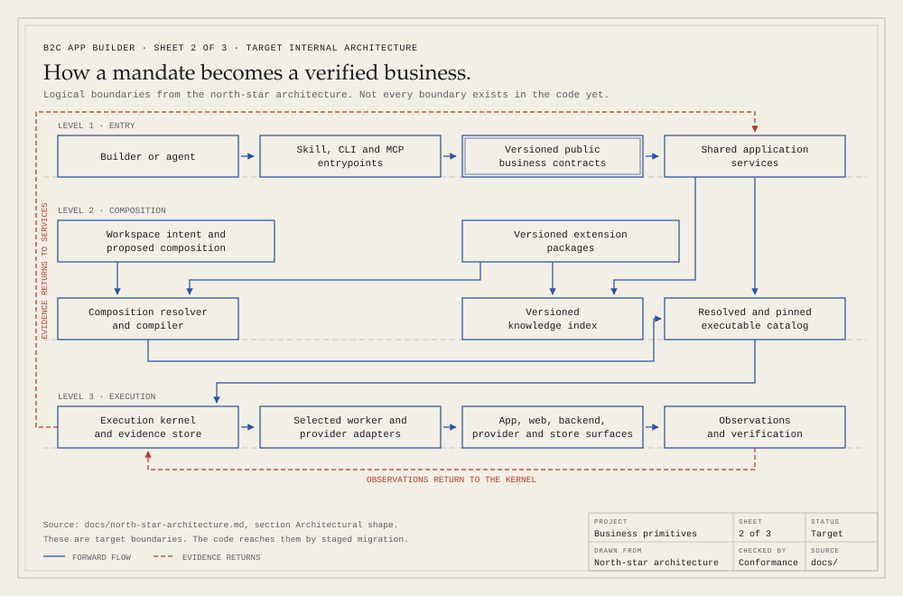
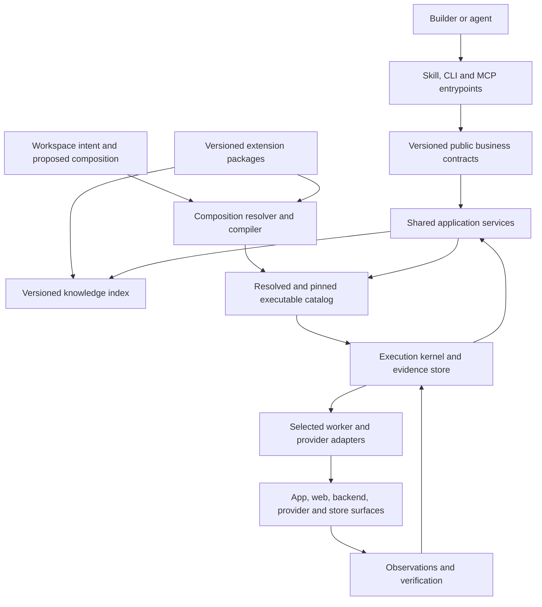

# Consumer-business primitives: north-star architecture

Revision: 7 · Established: 2026-09-04 · Role: normative target architecture

This is the architecture against which new work and refactoring are reviewed. It
defines the intended system; it does **not** claim that every boundary exists in
the current code. [Current architecture](architecture.md) describes mechanisms
already present. The [migration plan](plans/2026-09-04-1747-refactor-consumer-business-primitives-plan.md)
assigns the work. The [conformance protocol](architecture-conformance.md) explains
how an auditor, implementer, and architecture steward use these documents.

The founder's [single-mandate decision](decisions/0003-single-mandate-business-system.md)
supersedes requirements to preserve obsolete formats or duplicate interfaces.
There are no installed users to migrate. Keep one current contract per responsibility.

## Purpose and success

B2C App Builder supplies the primitives for creating, launching, measuring, and
improving consumer-app businesses. A builder can use the opinionated default
recipe, replace a provider, change a product approach, or author a different
creation or operating loop. Those choices reuse the same execution and evidence
machinery.

The first outcome is one excellent, complete consumer-app business: a useful
product, distinctive design, reliable implementation, working acquisition funnel,
observable activation and retention, monetization, support, and operations. The
next outcome is a second meaningfully different business assembled with shared
primitives. The eventual outcome is a market experiment spanning independent app
businesses whose results can be compared responsibly.

The advantage comes from preserving what has been learned while making the next
business cheaper to create and operate. Generating more repositories or checking
more document boxes is not a substitute for that outcome.

One mandate carries work through research, creation, independent review, repair,
and verification. Required work remains pending until its evidence is accepted.
External authority requests identify the exact prepared action and resume point.

## Architectural shape

The Mermaid source below is the editable definition of the same shape.

Design these logical boundaries as greenfield contracts. Current directories,
commands, and internal types are not constraints on the target. Start as a local
modular application; replace incomplete mechanisms behind one current contract. A deployment boundary needs
a measured reason.

References below to existing files, services, leases, and reducers identify the
current adapters. They do not require retaining those implementations.
The invariants are their responsibility, authority boundary, evidence semantics,
and single ownership. Replace an adapter when useful; keep the public contract aligned and preserve current authoritative data.

The [public interface](public-interface.md) owns the supported consumer surface.
Discovery and composition preview are the first stable `b2c/v1` slice. The wider
provider SDK and execution contracts remain experimental until their proofs pass.
Every release must keep README, agent guides, skill, CLI, MCP, examples, and schemas
aligned with the same supported surface. Historical plans are not API authority.

| Term                    | Meaning                                                                                        | Must not be confused with                               |
| ----------------------- | ---------------------------------------------------------------------------------------------- | ------------------------------------------------------- |
| Capability              | A consumer-business responsibility with versioned operations and acceptance semantics          | A vendor name or available tool                         |
| Operation               | A typed action or observation, with inputs, effects, outputs, and proof obligations            | A prose instruction claiming completion                 |
| Provider implementation | An implementation of specified operations for specified platforms and versions                 | A grant of access or universal capability coverage      |
| Extension package       | A distributable unit containing declared capabilities, implementations, recipes, and resources | Another plugin runtime or an implicit trust boundary    |
| Recipe                  | A configurable arrangement of workflows, policies, decisions, review, and recurrence           | Another scheduler or state machine                      |
| Binding                 | A workspace selection connecting an operation to an implementation and connection reference    | A credential or mutable provider observation            |
| Composition             | The fully resolved recipe, operation bindings, package resources, and contracts                | The unreviewed contents of a configuration file         |
| Evidence                | A recorded observation tied to the claim, subject, environment, and relevant revisions         | A template, source-code presence, or manifest assertion |

## Rules and ownership

Stable `ARCH-xx` IDs are the review vocabulary. Keep IDs when clarifying a rule.
Change a rule explicitly when changing its contract; never weaken it silently to
make an incomplete implementation pass.

### ARCH-01: Consumer-business scope

Every public primitive must improve consumer-app research, product, design,
engineering, launch, acquisition, monetization, trust, support, or operation.
Planes remains parked. This architecture does not authorize a generic agent
framework, a B2B system, or a marketplace for arbitrary automation.

### ARCH-02: One execution kernel

Keep one catalog composition pipeline, compiler, knowledge index, planner,
reducer, and workspace execution store as logical owners. Recipes compile to
versioned executable work. Existing graph and occurrence machinery are migration
adapters, not permanent design constraints. Replace an owner behind its contract
when justified; do not create competing truth or orchestration stores. World
ontology describes business objects; the agent graph
is an ordered map of work over those objects.

The kernel owns execution identity, dependency scheduling, revisions, resource
coordination, authority enforcement, evidence binding, interruption recovery,
and reconciliation. It must not choose a monetization vendor, category, brand,
visual style, or growth strategy.

Catalog-generated task skills are entrypoint projections of this same logical owner. Public navigation may group existing domains without changing their IDs, scheduling, or authority. A task skill does not create another method store, planner, provider selector, or acceptance path. See [ADR-0014](decisions/0014-task-skill-projections.md).

### ARCH-03: Separate capability, implementation, and recipe

A capability defines meaningful operations and the outcomes required to accept
them. An implementation supplies supported behavior. A recipe chooses the
business approach, dependencies, optional capabilities, policy thresholds, and
review moments. The default consumer-business recipe is a first-party product
with a strong opinion and a short setup path.

Do not make every option mandatory during onboarding. Start from the default;
expose substitutions where the builder needs them. Domain judgment belongs in
capability knowledge and recipes. Provider procedures belong with their selected
implementation. New and upgraded provider transports follow
[provider integrations](guides/provider-integrations.md) and
[ADR-0013](decisions/0013-provider-integration-boundary.md) rather than
mirroring upstream commands in workflows. Safety and authority invariants remain
host-owned.

### ARCH-04: Bind operations, preserve semantic differences

Resolve each required operation to a declared implementation before execution.
Coverage includes platform, supported SDK/API range, operating mode, and feature
limits. Reject missing, ambiguous, or incompatible required bindings. Optional
exclusions must remain visible. Do not silently fall back to another provider.

Providers can cooperate. One can present a paywall while another executes a
purchase and owns entitlement truth. A capability need not have one vendor for
all operations. Each entitlement responsibility and experiment assignment has
one authoritative owner; explicit delegation describes the relationship.

Common contracts preserve business semantics, not just matching method names.
Matching names do not prove substitutability: a RevenueCat experiment is not a
PostHog experiment, and paywall display is not entitlement truth. Provider-qualified
remote IDs, opaque pagination or job references, and sanitized source observations
may cross the adapter boundary as typed evidence. Business policy must not inspect
vendor-specific payload layouts. Expose provider-specific optional features with
declared requirements instead of reducing all providers to the weakest common
feature set.

### ARCH-05: One public extension path

First-party and community packages use the same versioned schema, resolver,
resource rules, compiler, and conformance suite. No undocumented first-party
privileges. Start with explicit local package imports; a remote registry,
automatic package installation, and marketplace are outside this migration.

The public boundary uses strict JSON Schema 2020-12 and one normalized typed
representation. Preserve all supported semantics across TypeScript and YAML.
Reject unknown fields and unsupported host contract versions rather than
dropping them. Namespace new exported IDs; preserve existing public IDs through
explicit compatibility mappings. Dependencies and imported exports are declared.

Distinguish the stable consumer facade from evolving executable extension APIs.
Discovery and composition declaration/preview can stabilize before package
execution. New executable extension APIs begin as experimental versioned contracts. Preserve pinned
workspaces even while those APIs evolve. Promote a contract to stable only after
the external-package proof and real business uses exercise its supported surface
across monetization and at least one structurally different capability family;
do not imply that an experimental version has a stable ecosystem guarantee.

### ARCH-06: Pin resources, not paths

The versioned public schema covers authored workspace composition as well as
package entities. Unsupported configuration versions fail before preview.

A local package path is an import source. The active composition uses an
immutable content-addressed snapshot. The digest covers every consumed
manifest, schema, knowledge reference, prompt, gate, and adapter artifact plus
the resolved dependency closure. Published version labels alone are insufficient.

Resolve resources relative to their owning package. Reject escaping paths,
identity collisions, unresolved dependencies, unexpected symlinks, and changed
bytes. Discovery parses metadata; it executes no lifecycle hook, dynamic import,
or package code. Execution verifies pinned resources and uses the existing
approved execution route. Conformance does not make arbitrary code safe and
does not provide a sandbox. Package execution inherits only the host's actual
permissions; a manifest cannot claim confinement the host does not enforce.

Platform build dependencies are pinned through their native dependency lockfiles,
exact source revisions or available checksums, and recorded toolchain/build
provenance. Include those declarations in the package digest; bind the resulting
build artifact to device/provider proof. A package snapshot does not itself freeze
remote provider configuration or download every native SDK binary.

An upstream project carries five distinct version facts: the latest observed
release, the reviewed baseline, the builder's supported range, the workspace's
composition pin, and the executable or service observed at execution. Each fact
keeps its own field: `baselines` and `support` in `catalog/upstreams/<id>.yaml`,
the recorded observation, and the workspace pin. A newer upstream release changes
none of the others until a maintainer reviews it. ADR-0007 records this rule.
Provider upgrades keep those facts distinct through the
[provider integration lifecycle](guides/provider-integrations.md); they do not
repin a business or invalidate pinned historical evidence by observation alone.

### ARCH-07: One owner for each kind of truth

| Information                                                                 | Authoritative owner                                                                          | Derived or referencing surfaces                                                |
| --------------------------------------------------------------------------- | -------------------------------------------------------------------------------------------- | ------------------------------------------------------------------------------ |
| App promise, audience, scope, product requirements and decisions            | Workspace `product.yaml`                                                                     | Rendered `PRODUCT.md`; linked detailed contracts                               |
| Global experience and design decisions                                      | Workspace `DESIGN.md`                                                                        | Linked flows, screens, component and platform contracts; generated Design Room |
| Proposed recipe, package selections and operation bindings                  | Proposed workspace `b2c.yaml`                                                                | Preview only until explicit apply                                              |
| Active composition and installed package digests                            | Existing generated runtime installation manifest and catalog pin                             | Status and compiled contracts                                                  |
| Provider account/project/app/environment, secret references, and forbidden provider-project exclusions | Existing `operations/business-access.json` contract (schema 2.1.0 `forbiddenProviderProjects[]`) | Bindings reference connection IDs; mandate tables may mirror names only; no copied credentials |
| Machine-local host executable snapshot (PATH winner, parsed version, latest-tag comparison) | Sanitized file under engine home, written only by CLI `inspect`/`setup`. `doctor` is a supported equivalent | MCP/`b2c_status` may read the stored file; they never spawn upstream executables or sync this into `catalog/upstreams/observations/` |
| Live App Store portfolio apps-list receipt | Reducer-protected workspace `run/app-store-portfolio.json` (same owner class as `run/app-review.json`) | Frontier hold plus receipt validator; MCP/status may read the stored receipt |
| Metric definitions and interpretation                                       | Proposed workspace `operations/metric-contracts.json`, aligned with the earlier cockpit plan | Product links, recipe requirements, and versioned reducer metric records       |
| Attempts, accepted proof, observations, pending work, authority and history | Existing reducer-owned workspace state                                                       | CLI/MCP status, cockpit, portfolio read models                                 |
| Workspace identity and address                                              | Existing local registry                                                                      | Cross-workspace references                                                     |
| Code and authored design history                                            | Git                                                                                          | Reviews and fingerprints                                                       |
| External project identity, license evidence, baselines, support, adaptations | `catalog/upstreams/<id>.yaml` with `notices/` and `observations/` (ADR-0005, ADR-0007)      | Knowledge manifests, provider contracts, generated credits and support reports |

`b2c.yaml` is a **new target contract**, introduced by the roadmap. It owns
composition only. Do not copy product pricing, requirements, observations,
secrets, execution status, or authority into it. Extend the existing generated
installation pin; do not add a second lock or state file for the same facts.

### ARCH-08: Explicit, recoverable composition migration

Editing `b2c.yaml` proposes a change; it does not alter active behavior. Preview
binds the proposed configuration digest, immutable package digests, existing pin,
and expected workspace revision. It identifies retained, reopened, new, and
removed obligations, changed resource claims, and required follow-up. Show package
digests, executable entrypoints, resource claims, and requested authority categories.
Applying composition records the selection; it grants no execution authority.

Apply rechecks those inputs under the existing workspace lease. Refuse a stale
preview or migration of affected running attempts. Use a recoverable transaction
within the current runtime persistence boundary: after interruption, readers see
the old composition or a named incomplete migration requiring recovery, never a
valid-looking mixture. Recovery resumes or restores local composition metadata;
it does not promise to reverse external effects.

Preserve unchanged node identities and all historical receipts. Reopen affected
claims and downstream acceptance when their dependency contracts change. Retain
pending occurrence identities and cadence. An uncertain previous provider action
requires readback before replay under either implementation. An engine update
alone must not repin a business. A live provider/data migration is a separate,
authorized workflow with explicit identity and continuity checks.

Retain removed workflows' historical contracts and receipts in existing run
state. Retire undispatched occurrences with a migration reason. Refuse removal
while external effects remain unresolved. Re-adding a workflow does not revive
retired occurrences; a new occurrence needs a new explicit scheduling decision.

### ARCH-09: Shared agent and operator services

CLI and MCP project one versioned operation registry and shared application
services. Define names and types from business semantics. Remove obsolete names and duplicate adapters. Each operation has one public meaning.
Reject unsupported contract versions explicitly.
For a new business, route to the shared creation operation. Reserve workspace
registration for adoption of an existing scaffold, and expose actionable recovery
without automatic removal of files or registrations. See [ADR-0008](decisions/0008-agent-onboarding-entry-path.md).
Public contracts must not expose raw internal runtime, provider SDK, or authority
objects. Generate schemas and reference documentation from the same owner. Read-only MCP returns declarations, resolved
plans, stored observations, limitations, and next actions. It may return
CLI-written engine-home host snapshots and reducer-stored provider observe
receipts. It must not spawn upstream executables or perform scoped provider
reads. Approved workers, connected tools, or CLI adapters perform the scoped
provider work and record receipts. See [ADR-0010](decisions/0010-first-run-honesty-owners.md).

Initialized `business.plan` projects typed holds, bounded briefs, a sanitized last
failure, and at most one founder question bound to `appliesToRevision` from the
existing planner report. Historical held `reason` text is unchanged. The question
is not an approval. See [ADR-0011](decisions/0011-additive-public-business-plan-projection.md).

Existing explicitly enabled MCP writes retain their current gates. New bindings
do not widen the MCP write surface. Selected capability and provider knowledge
must reach worker briefs through the existing bounded knowledge service, with
required coverage and explicit truncation. Unselected provider instructions must
not leak into the selected operation's brief.

Package instructions are subordinate reference material. They cannot expand
compiled scope, grant authority, or establish success. The same holds for an
adopted upstream's README, `SKILL.md`, or agent files. The mandate, the selected
recipe, the capability contract, and the selected provider outrank them in that
order. Upstream guidance cannot add a business requirement, widen provider
permissions, install tooling, change provider selection or business state,
override evidence requirements, redefine completion, publish, or spend unless
the selected operation permits that behavior. External subprocesses use
host-controlled environment allowlists. Deterministic local gates receive no
provider credentials or vault token. Provider operations receive only the secrets
needed for the selected authorized connection, resolved at execution time through
the existing access mechanism. Never persist those values in packages or receipts.

### ARCH-10: Authority and resource claims are executable contracts

Tools, provider support, recipe selection, and manifest declarations never grant
authority. Tool discovery and official SDKs also do not. Enforce the existing
mandate and approval rules at the effect boundary. Retries and recipes cannot
bypass them. Read-only observations remain distinct from writes, spending, access
changes, and release actions. Provider adapters return observations and remote
identities to the existing execution owner. They do not create a second scheduler
or operation journal. After a confirmed write, a failed readback resumes
observation; it does not authorize blind replay.

Separate acceptance-artifact ownership from read/create/update resource claims.
A workflow can read an accepted artifact and update a declared source tree or
explicitly versioned artifact without making all inputs mutable. Undeclared
input changes fail. Conflicting writes serialize. Fingerprints cover declared
source roots, including nonstandard roots such as `native/` and `landing/`.

Package-declared app write claims resolve inside the selected workspace after
path and symlink checks. They cannot include immutable package snapshots, the
builder checkout, VCS internals, or reducer/authority-owned state. Only the
existing host-controlled services can mutate those protected runtime surfaces.
These are declaration and host-route checks, not a sandbox claim for arbitrary code.

Cross-workspace effects also claim their shared provider, account, store,
device, or budget resource. Reuse execution identity and receipt reconciliation;
do not rely on prompt discipline for exclusion or duplicate-effect prevention.

A shared claim names its workspace, occurrence, and ownership generation. A
stale holder cannot dispatch or commit under lost ownership. Expiry alone does
not authorize reassignment: first confirm the prior execution has stopped and
reconcile in-flight effects. If that cannot be established, block takeover for
recovery. Provider-supported idempotency can prevent replay where available;
do not claim exactly-once external effects from a local lease alone.

A public request receipt belongs to the same session owner. After interruption,
recovery may close that exact receipt only under current revision and ownership
checks, with unresolved effects still blocked. Closing a request cannot dispatch
work, accept evidence, replace its payload identity, or grant authority.

### ARCH-11: Readiness and evidence remain separate

Report at least these independent dimensions: declared support, implementation
maturity, workspace configuration, available execution route, granted authority,
and observed proof. No requirements or missing observations mean unknown, not
ready. A fixture can prove package conformance; it cannot prove a live business.
Fixture conformance, live provider execution, native app behavior, store behavior,
and production behavior remain different evidence classes.

Each observation identifies the claim and operation, capability contract,
implementation/package digest, binding, account/project/app/environment, relevant
configuration, subject identity, time, and provenance. Bind deployed artifact,
metric definition, and proof-policy revisions when the claim depends on them.
Keep secrets and personal payloads out of public artifacts. A content hash proves
which bytes were referenced; it does not prove that a runtime observation occurred.

Manual prerequisites return an owner, required action, accepted evidence shape,
and resume point. Pending, failed, unsupported, unconfigured, and unverified
states remain legible. Required unsupported work blocks only dependent work.
Judgment and visual review stay explicit, independent acceptance activities.

### ARCH-12: Comparable measurement is a product primitive

Define canonical app/environment/subject identities and provider mappings,
including anonymous use, sign-in, logout, restore, and deletion obligations.
Link acquisition, actual exposure, activation, purchase, entitlement, retention,
and support observations where consent and available identity permit. Preserve
unknown attribution; never invent a cross-device join.

Keep resolvable user identity mappings in the app/provider data boundary, separate
from long-lived orchestration receipts. Capture only the minimum opaque references
needed for verification. Under the business's approved deletion policy, remove
identity mappings and redact or delete subject-linked observations as required;
retain non-identifying erasure/verification metadata. Recompute affected aggregates
or mark them invalid. History preservation does not authorize retaining personal
data indefinitely. Test deletion after evidence has already been accepted. Use
a dedicated authorized reducer erasure transition; ordinary record mutation
remains forbidden. Erasure covers retained snapshots and projections containing
the affected data, not only the newest record.

Experiment contracts name hypothesis, treatment, assignment unit and owner,
eligibility, exposure rule, decision horizon, primary metric, guardrails, and
stopping policy. Declare maturity and comparability criteria in the experiment
version: required observation window, eligible/exposed population, minimum usable
sample if applicable, and allowed missing-join coverage. Insufficient information
means inconclusive, not a winning treatment. Metric contracts name event/schema version, numerator and
denominator, units, cohort/window/timezone, exclusions, maturity, currency and
amount units, gross/net/refund treatment, and actual versus estimated cost.
Reject incompatible comparisons rather than ranking incomparable numbers.

Distinguish within-app randomized experiments from comparisons between separate
businesses. Ten independently marketed apps do not automatically constitute a
randomized experiment. Preserve allocation, acquisition mix, cohort age, and
uncertainty so a founder can interpret the result. Late refunds or corrected identities create
revised observations and reports; retain the prior report as historical evidence.

### ARCH-13: Reuse infrastructure, preserve product freedom

Shared primitives support identity, entitlements, analytics, experiments,
distribution, data, support, and operations. App-specific source owns the product
loop and interaction. Platform-neutral component contracts define behavior;
native adapters provide implementation and proof. A shared contract does not
require identical screens, navigation, art direction, or information architecture.

Configure bounded choices that are already understood. Generate and evolve code
for novel product behavior. Avoid a universal app DSL, mandatory visual template,
or lowest-common-denominator cross-platform UI. A starter is a starting point;
unimplemented behavior stays visible as incomplete.

[ADR-0009](decisions/0009-bespoke-design-foundations.md) refines design reuse: the existing DESIGN authority records communication, rationale, identity invariants and typography; expressive methods remain conditional. Product outcomes and independent review establish suitability. Aesthetic pattern counts cannot replace that evidence.

### ARCH-14: Portfolio scale follows complete businesses

Keep independent app workspaces and provider/environment isolation. The initial
portfolio is one operator's registered workspaces; a shared multi-owner service
requires a separate authorization design. Ten is a proof target, not a hard-coded
limit or a claim of larger-scale performance. A market
experiment references workspace IDs and authored hypotheses; its read model
aggregates versioned observations instead of copying each app's execution state.
Allocation and Kill/Hold/Fix/Scale decisions retain founder authority. The earlier
cockpit plan's compact portfolio summary is a planned surface, not implemented
behavior in the reviewed checkout. Keep its proposed summary-only contract;
scoped measurement belongs in an explicit experiment report. An authored portfolio register identifies proposed businesses. Only a report
built from current versioned observations can establish a portfolio result.

Prove one complete business, a materially different sibling, and bounded
multi-workspace coordination before a ten-business run. Sharing the kernel does
not require all apps to share a backend deployment, database, release, or blast
radius. Store differentiation, release, spend, and traffic decisions remain
explicit constraints of each authorized experiment.

Prove that a fresh-context agent can use the documented public entrypoints and
selected knowledge without undocumented maintainer guidance. Record human
intervention by purpose and effort; keep business decisions separate from hidden
integration or orchestration repair. Close those repeatability gaps before
claiming builder advantage. Also demonstrate an actual observe–decide–change–verify
cycle; an inconclusive or negative experiment result is acceptable evidence that
the operating loop works.

### ARCH-15: Enforce architecture without freezing it

An architecture steward owns cross-cutting contracts, dependency direction,
truth ownership, compatibility, and exceptions. Implementers own bounded units;
independent auditors judge evidence against this document. The role is
transferable; it does not depend on hidden chat history or one permanently
running agent.

Compatible internal choices proceed without founder approval. A change to a
public contract, owner, authority boundary, mandatory invariant, or migration
guarantee requires an architecture decision with alternatives, impact, evidence,
and a migration path before implementation. The steward resolves engineering
tradeoffs. Only the founder grants reserved business or external authority.

Record accepted changes in the owning rule and, for a material change, an ADR
under `docs/decisions/`. Keep execution progress in the existing task/issue system
or runtime, not in this architecture or the immutable unit numbering. Classify
existing debt explicitly; changed code must not expand it. Never add blanket
exceptions or edit a rule only to silence a failed check.

## Repository layout

[ADR-0002](decisions/0002-repository-layout.md) makes the repository root the
package root and names one top-level directory per layer of the diagram above.
The directory tree is the first enforcement of dependency direction: a check
over top-level prefixes rejects an import that points the wrong way before any
file-level rule is needed.

| Directory             | Responsibility in the diagram                                                                     | Contents today                                                                                                |
| --------------------- | ------------------------------------------------------------------------------------------------- | ------------------------------------------------------------------------------------------------------------- |
| `SKILL.md`, `agents/` | Skill entrypoint (E)                                                                              | Router and Codex skill metadata                                                                               |
| `entrypoints/`        | CLI and MCP entrypoints (E)                                                                       | `cli/b2c.mjs`, `mcp/b2c-app-builder-mcp.mjs`, `mcp/server.ts`                                                 |
| `contracts/`          | Versioned public business contracts (V1); shared logic below runtime and checks                   | `public-api/`                                                                                                 |
| `kernel/`             | Execution kernel, evidence store, shared application services (S, X)                              | engine, reducer, session, work orders, operating model, autonomy, context, routing, knowledge service, schema |
| `catalog/`            | Composition resolver and compiler (C, R); first-party definitions and generated pins until Move 2 | typed catalog, packs, capabilities, providers, generated projections                                          |
| `knowledge/`          | Knowledge index source (K) until Move 2                                                           | first-party references                                                                                        |
| `adapters/`           | Selected worker and provider adapters (A)                                                         | adapters, providers, provisioning, app review                                                                 |
| `surfaces/`           | App, web, and design surfaces the runtime installs or renders (O)                                 | starters, ui-library, workspace-template, studio                                                              |
| `hosted/`             | Separately deployed services                                                                      | `knowledge-mcp/`, `builder-console/`, `shared/`                                                               |
| `examples/`           | Reference businesses and, later, reference extension packages                                     | `workspace/`, `tuck/`                                                                                         |
| `checks/`             | Observations and verification (V)                                                                 | `validation/`, `verification/`                                                                                |
| `tooling/`            | Renderers, audit runner, maintenance                                                              | unchanged                                                                                                     |
| `docs/`               | Architecture, decisions, plans, guides                                                            | unchanged                                                                                                     |

Dependency direction, top to bottom: `contracts` imports nothing internal.
`kernel` and `catalog` import `contracts`. `adapters` imports those. `entrypoints`
and `hosted` import services and never adapters directly. `knowledge`,
`surfaces`, and `examples` are data plus subordinate instructions and import no
runtime. `checks` and `tooling` may import anything; nothing imports `checks`.

Move 2 belongs to U4, U5, and U9: first-party packs, capabilities, providers,
and the knowledge corpus move into `packages/` in the exact shape an external
package must have, and the remaining compiler in `catalog/` is renamed
`composition/`. This section reserves those names; those units own the proof.

## First reference composition

The first extension proof covers iOS/SwiftUI offer experimentation. This is a
bounded proof of substitutability, not a platform-wide support claim.

| Responsibility                                 | Default proof                                                  | Alternative composition proof                                                         |
| ---------------------------------------------- | -------------------------------------------------------------- | ------------------------------------------------------------------------------------- |
| Purchase execution and entitlement authority   | RevenueCat                                                     | RevenueCat                                                                            |
| Paywall presentation                           | Existing default implementation, inventoried before extraction | Superwall with explicit RevenueCat purchase delegation                                |
| Assignment for the selected paywall experiment | Existing default assignment owner                              | Superwall; competing assignment owner rejected                                        |
| Revenue/subscription observations              | RevenueCat, normalized through the metric contract             | RevenueCat observations joined to Superwall exposure using declared identity mappings |

Verify cancellation, pending purchase, delayed entitlement, restore, duplicate
callbacks, logout, and anonymous-to-identified transitions. Presentation or a
purchase callback alone cannot grant entitlement. Other stacks/modes remain
unsupported until they implement and prove the corresponding tuple.

This division follows the providers' documented integration model:
[Superwall's RevenueCat guide](https://superwall.com/docs/ios/guides/using-revenuecat)
and [RevenueCat's Superwall integration](https://www.revenuecat.com/docs/integrations/third-party-integrations/superwall).
Implementation must verify compatibility with its pinned SDK versions. Public
contract versioning follows [Semantic Versioning](https://semver.org/spec/v2.0.0.html);
schema boundaries use [JSON Schema 2020-12](https://json-schema.org/draft/2020-12).

## Capability coverage beyond monetization

Use the same extension rules across these business responsibilities. This is a
coverage map, not a universal interface or a claim that all adapters exist.

| Responsibility                | Shared semantics                                                                  | Variation stays with the implementation or recipe                                       |
| ----------------------------- | --------------------------------------------------------------------------------- | --------------------------------------------------------------------------------------- |
| Identity and customer data    | Subject, access, lifecycle, deletion and recovery                                 | Auth provider, storage model, anonymous/local-first posture                             |
| Mobile app operation          | Launch, observation, interaction, capture provenance and task-specific acceptance | Host-native tools, MobAI, other providers, simulator/emulator/device and capture format |
| Product experience            | User outcome, state behavior, accessibility and acceptance                        | Product loop, navigation, design system and native stack                                |
| AI and media                  | Input/output quality, latency, usage, cost and failure policy                     | Model, hosting, modality and inference strategy                                         |
| Monetization                  | Purchase, entitlement, offer, exposure and normalized revenue                     | Paywall, billing, store and experiment provider                                         |
| Analytics and experimentation | Events, assignment, exposure, cohorts and metric definitions                      | Capture/query provider and experimentation engine                                       |
| Acquisition and lifecycle     | Funnel identity, conversion, consent, delivery and attribution                    | Web stack, ads, email, notifications and deep links                                     |
| Support and operations        | Case, incident, evidence, response and recovery                                   | Helpdesk, observability, service provider and cadence                                   |
| Distribution                  | Artifact identity, signing, release state and store evidence                      | Build service, device tooling, store and release approach                               |

U1's migration inventory names the current owner, vendor assumptions, evidence,
and next bounded migration for each responsibility. After U14 proves the public
path, extract additional slices when the benchmark or an actual contributor needs
them. Each slice gets its own stable work-unit ID and the same external-package
proof before its support is advertised. This avoids declaring an untested generic
API complete while keeping the whole platform's extension direction explicit.

## Mobile app operation is a shared capability

Use mobile app operation across product exploration, functional checks, design
and accessibility review, screenshot capture, and marketing source footage. The
operation contract outlives its provider; the recipe owns purpose and acceptance.
Raw captures and finished creative are separate artifacts with traceable provenance.

Honor explicit bindings. Otherwise prefer native tools already available in the
current agent host when they cover the target, operations, and required evidence.
Inspect actual support; Claude or Codex identity alone proves nothing. Select
MobAI or another provider when its coverage fits the remaining requirements.
Missing native coverage must not silently reduce platform or evidence scope.
Selection flows through the same composition and execution services as every
other capability. Vendor-specific validators apply to their selected adapters;
provider-neutral acceptance evaluates the normalized claim and evidence.

The [mobile operation contract](guides/mobile-app-operation.md) defines routing
and output boundaries. U26 owns executable adapter conformance. The initial public
preview supplies native defaults and explicit provider overrides without probing
or operating a device.

## Public contract first

Freeze supported consumer requests and result semantics before replacing internal
mechanisms. Preserve accepted v1 fixtures across every adapter change. New
operations may be additive; breaking supported semantics require a new major
version and an architecture decision. ADR-0003 permits a direct cutover for
this system while it has no installed users. Do not promise that unfinished execution contracts are already stable.

The current first slice is `b2c catalog` / `b2c_discover` and `b2c compose` /
`b2c_compose`, plus `b2c business-status` / `b2c_business_status` for registered
workspace lifecycle and aggregate work counts. Composition validates and previews
the initial monetization declaration.
It does not apply composition, load external packages, verify providers, or run a
full-business recipe. This is a useful public contract ahead of internal
refactoring, not evidence that the later roadmap is complete. See U23–U25.

## Implementation and outcome evidence

The [implementation inventory](architecture-migration-inventory.md) maps each
responsibility to its current owner and local proof. Architecture rules do not
certify a release.

First-party and imported packages use the same immutable resource loader and
composition compiler. The default recipe explicitly maps 99 consumer workflows
to the trusted host worker adapter. Provider identity stays distinct from an
operation implementation. Bootstrap accepts the authored product and installs
that composition through the recoverable initializer; template installation
cannot replace an active pin. Shared resource claims coordinate conflicting work
across businesses, while independent work can run concurrently.

The remaining outcome proofs require actual business execution:

| Proof                          | Evidence required                                                                                                                        | Rules            | Roadmap  |
| ------------------------------ | ---------------------------------------------------------------------------------------------------------------------------------------- | ---------------- | -------- |
| Complete consumer business     | Accepted product, working selected surfaces, acquisition, retention, monetization when selected, support, and independent current review | ARCH-11–ARCH-14  | U16, U18 |
| Meaningfully different sibling | Independent acceptance, reusable infrastructure, product variation, isolation, and fresh-agent repeatability                             | ARCH-13, ARCH-14 | U19      |
| Alternate provider deployment  | Linked app and current device/provider observations for the selected contract                                                            | ARCH-04, ARCH-11 | U17, U26 |
| Market experiments             | Comparable mature observations from independently accepted businesses                                                                    | ARCH-12, ARCH-14 | U20      |

An optional hosted console remains a distribution surface. Its billing,
identity, and deployments do not establish reusable app-business infrastructure
or authorize a generated business's external effects.

## What is deliberately deferred

Remote extension installation, a plugin marketplace, a new sandbox, a distributed
scheduler, and automatic provider data migration are not prerequisites.
Generating a complete consumer-app business from one mandate is the product
objective. Prove that outcome on supported compositions before expanding coverage. Broader provider and capability coverage follows the first
external composition proof. Ten public launches require separate explicit
authorization and mature business evidence; a local simulation cannot satisfy
that milestone.
