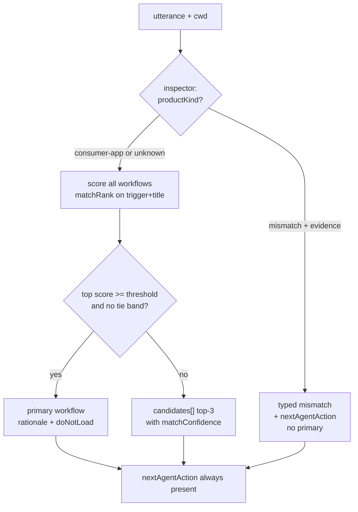

# Founder-Zero Wave 1 - Plan

## Goal Capsule

- **Objective:** An agent that opens a session in any folder — registered or not — gets one routed workflow, an honest status with one founder action, and a legible onboarding position, without loading the catalog map or reconstructing engine state; and it can pass an operate request and page the catalog without paying avoidable token tax.
- **Means:** Extend the existing MCP/CLI surfaces (`b2c_plan`, `b2c_status`, `b2c_catalog`, `b2c_operate`) and the catalog definitions — zero net-new MCP tool names (KTD1).
- **Authority hierarchy:** GitHub issues #26, #27, #28, #29, #35 are the product contract; this plan is the implementation contract; `AGENTS.md` and `docs/architecture.md` govern where code may live. On conflict, the issue's acceptance criteria win on behavior; `AGENTS.md` wins on repository structure.
- **Stop conditions:** Stop and surface to the user if (a) any change would add a new MCP tool name, (b) any pre-registration path would reach a write tool or founder-gated action, (c) the registered-workspace behavior of `b2c_plan`/`b2c_status` would change shape, or (d) a change would require reversing the `presentationGroups` retirement beyond the scoped `groupId` fixture amendment in U5.
- **Tail ownership:** The primary session owns integration, Git, and final verification (per `AGENTS.md`). Subagents receive isolated files only.

---

## Product Contract

### Summary

Wave 1 closes the first-session gap in the founder-zero interface: utterance routing and a pre-registration cockpit land as modes of `b2c_plan` and `b2c_status`, backed by one shared read-only workspace inspector with an explicit anti-traversal boundary; the 23-node onboarding graph gains a grouped stepper projection; `b2c_catalog` stops resending the 15-domain preamble; and `b2c_operate` accepts an inline JSON request. A deterministic routing-accuracy fixture suite gates release.

### Problem Frame

The engine's doctrine is founder-zero, but its tools assume a maintainer: `b2c_status` and `b2c_plan` refuse unregistered folders (exactly where a beginner's first session starts), routing from a founder utterance to one of 101 workflows is unsupported, the onboarding graph presents 23 undifferentiated peers, every catalog page reships all 15 domain objects, and `b2c_operate` requires inventing a file path. Wave 1 of the operator-feedback triage (issues #26–#29, #35) fixes the first-session path.

### Key Decisions

- **Zero net-new MCP tool names; extend existing surfaces.** (session-settled: user-directed — chosen over eight new tools proposed in the operator brief: simplicity over complexity; the MCP surface stays at 12 registered names.) Governs R1, R6, R14, R16.
- **Pre-registration flows are local-stdio MCP only.** The hosted worker does not register `b2c_plan` or `b2c_status` at all, so the exclusion is architectural — no runtime refusal is built or tested. Governs R2, R6, R20.

### Requirements

**Routing (#26)**

- R1. `b2c_plan` accepts `{utterance, cwd}` as a second request shape, mutually exclusive with `{workspace}`; the response carries a `kind` discriminator; existing `{workspace}` calls keep the same response contract — fields and semantics unchanged; the regression oracle compares parsed report fields, not raw process output.
- R2. Unregistered-folder reads go only through the shared inspector's fixed marker-file allowlist: `lstat`-refuse symlinked marker files, treat per-file read/parse failure as absent, cap bytes read, and never join caller paths through the registry lookup. Evidence returned to callers is bounded independently of the read cap: structured signal descriptors whose quoted excerpts are capped well below the read cap — never raw file dumps from a caller-supplied folder.
- R3. At or above the confidence threshold, and outside any ambiguity-band tie, the routing response returns one primary workflow with a rationale of at most two sentences plus a `doNotLoad` hint; below the threshold or within a tie it returns top-3 `candidates[]` with `matchConfidence` and no primary; never both.
- R4. `productKind` is a typed three-state field (`consumer-app` | `mismatch` | `unknown`) with an `evidence` list; `mismatch` and `unknown` responses still carry a `nextAgentAction` — never a dead end.
- R5. Routing accuracy is measured by a deterministic fixture suite that blocks release, including the operator session's misses and a threshold boundary case.

**First-session status (#29)**

- R6. `b2c_status` on an unregistered folder returns `kind: "unregistered"` with inferred phase, a `nextAgentAction` carrying the exact `b2c workspaces register <id> <path>` command, a `founderAction` stub or null, and typed `blockers[]`; it never errors on an empty folder.
- R7. Registered `b2c_status` output is unchanged, including the corrupt-run-state (`run_state_unreadable`) path; the render text MCP clients consume stays stable.
- R8. `b2c_plan` and `b2c_status` derive pre-registration answers from one shared inspector, so the two surfaces cannot disagree about the same folder.
- R9. A `productKind` of `mismatch` suppresses the register suggestion and surfaces the mismatch instead.

**Onboarding stepper (#27)**

- R10. All 23 onboarding nodes (onb-00…onb-21 plus `workflow.experience.onboarding-conversion`) declare an authored `groupId`; group membership is never derived by id-substring match.
- R11. The stepper projection reports `totalCount`, `completedCount`, and `activeNodeIds[]` (the frontier is a set — the graph fans out 6-wide after onb-02), computed from compiled dependencies (after `dependenciesFor` injection), including out-of-group blockers such as onb-18's dependency on `workflow.design.design-room`.
- R12. Step completion uses run-state node status when a run exists; the pre-run fallback is outputPaths existence cross-checked against dependencies-satisfied, and an output that exists without its dependencies satisfied is surfaced as an anomaly, not counted complete.
- R13. Individual onboarding nodes remain addressable; generated projections are re-rendered and `b2c doctor` is green.

**Compact catalog (#28)**

- R14. The default `b2c_catalog` page returns compact workflow rows plus per-domain workflow counts; full domain objects return only under `include=domains`; the `domains` key stays present (empty by default) so existing consumers never read `undefined`.
- R15. The before/after token cost of a default page is measured and documented in the tool description; the shared `schemaVersion` is not bumped; the hosted HTTP surface serves the same shape and the compatibility contract is stated in the tool description.

**Operate inline (#35)**

- R16. `b2c_operate` accepts an inline JSON request via a new parameter, mutually exclusive with the file-path form; supplying both is a typed conflict error.
- R17. One shared validator covers both input forms and returns structured errors naming the failing field.
- R18. Read-only gating is identical for both forms: a commit in read-only mode is refused before any parsing or filesystem work, and the inline path introduces no new writes in read-only mode (no temp files).
- R19. The commit idempotency key derives from request content, never from the input mechanism.

**Cross-cutting**

- R20. Every Wave-1 surface is read-only; no pre-registration path reaches write tools or founder-gated actions; the router's job ends at "which workflow" and never implies a founder gate is satisfied.

### Scope Boundaries

- **Deferred to Follow-Up Work:** the full founder question-object schema (issue #30 — Wave 1 ships only the forward-compatible stub in R6); structured checks (#32), evidence dialect (#33), bundle mode (#34), proof/taste (#36, #37); non-English routing quality (Wave 1 ships honest degradation only: low signal → candidates or `unknown`, never an English-biased guess); catalog-hash drift handling between calls.
- **Outside this wave:** any write-surface change; hosted-transport pre-registration support; reviving `presentationGroups` or any founder UI surface.

### Assumptions

- The routing eval gate is satisfied by the deterministic fixture layer (PR-blocking) plus an update to the advisory `broad-request-narrated-not-routed.yaml` scenario — LaunchBench scenario YAML alone is advisory and does not block CI, so issue #26's "LaunchBench routing eval" wording is implemented at the layer that actually gates.
- The `founderAction` stub `{phase, class, prompt} | null` plus sibling `nextAgentAction` aligns with the `activeFounderGate` doctrine surface but is not field-for-field identical to the ledger validator's shape; Wave 2 (#30) owns exact schema reconciliation and extends, rather than renames, the stub's three fields.
- Catalog trigger/title text is discriminative enough for utterance scoring to meet the eval bar; if the eval proves otherwise, trigger text enrichment is in scope for U9 (it is catalog definition text, not schema).
- Existing-session compatibility for #28 is satisfied by the always-present `domains` key plus new `domainCounts`; no versioning mechanism is added.

### Sources

- Issues #26–#29, #35 (product contract); operator triage "Founder-Zero Interface Gap" rev 2.
- `entrypoints/mcp/server.ts` (tool registration, `workspaceOr`, write gate at :86, `runCli` at :64-72); `core/adapters/registry.ts:96-109` (anti-traversal resolution); `core/session/plan.ts:224-240` (CLI-only caller-path fallback — must not leak to MCP); `core/session/status.ts` (five states; render-stability warning at :99); `core/session/operate.ts:33-45` (file-only input, shallow validation).
- `core/knowledge-service/service.ts:16-100` (`terms`/`matchRank` ranking — the routing building block; :244 unconditional domain preamble), `core/knowledge-service/tools.ts` (structured-content and typed-error conventions).
- `catalog/types.ts:174-248` (`CatalogWorkflowDef` — no `groupId` today), `core/engine/compile.ts:120,169,293` (compiled `groupId` passthrough exists), `catalog/workflows/helpers.ts:38-51` (`dependenciesFor` injection), `catalog/workflows/product-experience.ts` (ONB DAG: fan-out at :104-200, fan-in at :225, cross-domain dep at :441, terminal node id at :727).
- `verification/fixtures/presentation-retirement.fixtures.ts:149-167` (pins `presentationGroups: []` and `groupId === undefined` — U5 amends the `groupId` clause only), `verification/fixtures/mcp.fixtures.ts` (MCP test template), `validation/repository/run-launchbench.ts:173-177` and `launchbench-evals.md:83` (deterministic-vs-behavioral layer split).
- `docs/architecture.md:170,181` ("MCP never probes arbitrary paths" — amended by U1), :239-249 (generated projections rule).
- Baseline (main @ e3c5320): `verification/fixtures/run.ts` green (804 pass, 4 skip); `test:validators` has one pre-existing failure ("current version discipline passes"); `check:catalog` green with one pre-existing warning (`cost_estimate_missing`).

---

## Planning Contract

### Key Technical Decisions

- KTD1. **Extend existing tools; zero net-new MCP names.** (session-settled: user-directed — chosen over the operator brief's eight new tools: simplicity directive; smaller long-run maintenance surface.) All five changes land on tools registered in the read-only default server.
- KTD2. **Routing is a `b2c_plan` mode with discriminated request shapes.** (session-settled: user-approved — chosen over a new `b2c_route` tool.) `{workspace}` and `{utterance, cwd}` are mutually exclusive; the response `kind` field names which contract answered. The routing branch follows the knowledge-tool convention (structured content, typed error codes), not the workspace-tool prose convention — the ACs demand typed fields.
- KTD3. **The cockpit is a degraded `b2c_status` mode.** (session-settled: user-approved — chosen over a new `b2c_cockpit` tool.) MCP-side branch only; the CLI's existing permissive caller-path fallback is not reused and not widened.
- KTD4. **One shared workspace inspector** (`core/session/inspect.ts`) owns the marker-file allowlist, product-kind inference, and phase inference; `b2c_plan` and `b2c_status` both call it. Chosen over per-tool inference: two implementations of the same classifier would drift and the surfaces could disagree (R8). It is the single new trust boundary and lands first.
- KTD5. **Utterance scoring reuses the knowledge-service ranking** (`terms`/`matchRank` over workflow trigger + title text) with the tie/ambiguity-band concept from `core/routing/rank.ts`, under new vocabulary (`matchConfidence`, `candidates[]`). Chosen over `core/routing/*`: that engine's eligibility stages require a provisioned workspace's control file and grants, which do not exist pre-registration. Threshold comparison is `>=` (at-threshold routes single); the boundary is fixture-tested. `matchConfidence` collapses `matchedTermCount` and the title boost into one documented scalar whose formula is fixed in U2 and stated in the tool description. The threshold value is calibrated in U9 against a calibration sample kept disjoint from the frozen regression corpus, and both chosen numbers are recorded in the fixture file — never tuned against the corpus that gates release.
- KTD6. **`productKind` is a closed three-state enum with evidence** (`consumer-app` | `mismatch` | `unknown`). An empty or evidence-free folder is `unknown`, never a default `consumer-app`; a wrong refusal is a founder-zero violation, so `mismatch` requires positive evidence under an explicit rule: inspect only `package.json` (name, description, keywords, dependencies) and the first 40 lines of `README.md`/`PRODUCT.md`; `mismatch` requires at least two independent foreign-product signals and zero consumer-app signals (an app-framework dependency or app/store product language counts as a consumer-app signal); anything else is `unknown`. Vertical does not decide kind: an apparel-brand folder with mobile-app signals is `consumer-app`, and U1's fixtures encode a positive and a negative apparel example.
- KTD7. **Onboarding grouping uses authored `groupId` on `CatalogWorkflowDef`, compiled into the node `groupId` slot.** Keep grouping in the catalog and prove compiled group membership with a regression fixture.
- KTD8. **The stepper is a frontier-set projection from compiled dependencies.** `activeNodeIds[]` plus counts, never a single step integer — the DAG fans out 6-wide after onb-02 and fans in at onb-09, onb-15, and onb-20. Completion reads run-state node status first, outputPaths-with-dependencies-satisfied as the pre-run fallback (R12).
- KTD9. **Operate inline input lands as a CLI `--request-json` string plus an MCP `requestJson` parameter — no temp files.** Chosen over MCP writing a temp file and shelling the existing path: that adds a filesystem write on every call in read-only mode and risks a path-derived idempotency key. One deep validator replaces the shallow key-presence check for both forms.
- KTD10. **Catalog compaction gates `domains` behind `include=domains` and adds an always-present `domainCounts`.** Chosen over a schema version bump: `schemaVersion` is shared by all four knowledge tools and the hosted HTTP surface, so a bump would falsely re-version three unchanged tools.
- KTD11. **The routing release gate is a deterministic fixture suite** in the verification harness, plus an advisory update to the existing routing LaunchBench scenario. Chosen over a `behavioral: true` scenario as the gate: scenario YAML never executes against the router's code and does not block CI.

### High-Level Technical Design

Component shape — the inspector is the single new boundary; both read tools branch on registration through it:

```mermaid
flowchart TB
  subgraph MCP["core/mcp/server.ts (read-only default)"]
    P[b2c_plan]
    S[b2c_status]
    C[b2c_catalog]
    O[b2c_operate]
  end
  P -->|workspace| REG[registry resolveRegisteredWorkspace<br/>unchanged, anti-traversal]
  S -->|registered| REG
  P -->|utterance + cwd| INSP[core/session/inspect.ts<br/>marker allowlist · productKind · phase]
  S -->|unregistered| INSP
  P --> RTE[route-utterance.ts<br/>matchRank scoring]
  RTE --> KS[knowledge-service ranking]
  C --> KS
  S --> STEP[stepper.ts<br/>frontier from compiled deps]
  P --> STEP
  STEP --> CAT[catalog/generated<br/>compiled nodes + groupId]
  O --> VAL[shared operate validator<br/>file path | inline JSON]
```

Routing decision flow (R3, R4):



The ONB stepper frontier: onb-00 → 01 → 02, then six parallel nodes (03–08) joining at 09; 10–14 parallel joining at 15; 16 → {17, 18, 19} joining at 20 → 21 → onboarding-conversion (terminal, destructive, founder-gated; its compiled dependencies also include the injected `agent-operations-ledger` node, and onb-18 depends on `workflow.design.design-room`). The frontier at any moment is the set of nodes whose compiled dependencies are all complete and which are not themselves complete.

### Sequencing

Foundations (U1, U5) → capabilities (U2, U6) → surfaces (U3, U4) → independent extensions (U7, U8, any time) → release gate (U9 last). U6's `plan.ts` wiring follows U3 even though `stepper.ts` sits in the capability tier. U5's catalog re-render lands with U5, not deferred to the end.

---

## Implementation Units

### U1. Shared workspace inspector and the bounded second resolution path

- **Goal:** One read-only classifier for unregistered folders, with the anti-traversal boundary made explicit in code and in `docs/architecture.md`.
- **Requirements:** R2, R8, R20; KTD4, KTD6.
- **Dependencies:** none.
- **Files:** `kernel/session/inspect.ts` (new), `adapters/registry.ts` (containment helper only — resolution contract unchanged), `docs/architecture.md`, `checks/verification/fixtures/inspect.fixtures.ts` (new).
- **Approach:**
  1. Inspector input is an absolute cwd; output is `{registration, productKind, evidence, phase, markers}` where `registration` is `unregistered | registered(id) | inside-registered(id) | registry-stale`.
  2. Registration probe: exact match via existing registry resolution; containment (`inside-registered`) via a new helper comparing real paths; a registered entry whose path no longer exists reports `registry-stale`, reusing the `missing` semantics — never re-inferred as fresh.
  3. Marker allowlist is a fixed constant (e.g. `package.json`, `PRODUCT.md`, `README.md`, `state/business-state.json`, `run/run-state.json`): `lstat` first and refuse symlinks, per-file try/catch to absent, byte cap per file, case handled as the filesystem reports it (documented).
  4. `productKind` per KTD6: `mismatch` only on positive foreign evidence (e.g. a `package.json`/README clearly describing a non-consumer-app product); empty or ambiguous evidence is `unknown`.
  5. Phase inference distinguishes "no prior B2C engagement" from "engaged but unregistered" using the same file signals `readWorkspaceStatus` uses for registered workspaces.
  6. Amend `docs/architecture.md`'s MCP section: registry resolution stays the only path to a workspace; the inspector is a second, bounded, read-only resolution path for pre-registration orientation, and never feeds write tools.
- **Test scenarios** (fixtures use `makeTempDir`):
  1. Empty dir → `unregistered`, `productKind: unknown`, empty evidence, no throw.
  2. Symlinked `PRODUCT.md` pointing outside the folder → marker treated as absent; no read through the link.
  3. Unparseable and >cap `package.json` → absent for signal purposes; no throw.
  4. `EACCES` on a marker (chmod 000) → absent; no throw.
  5. Subdirectory of a registered workspace → `inside-registered` with the registered id.
  6. Registered path removed from disk → `registry-stale`, not fresh-unregistered.
  7. Clothing-brand fixture folder (non-app `package.json` + apparel README) → `mismatch` with evidence strings.
  8. Half-scaffolded folder (`run/run-state.json` present, unregistered) → phase reflects prior engagement.
  9. cwd does not exist → typed error distinct from empty-folder success.
- **Verification:** new fixture file green in `verification/fixtures/run.ts`; no change to any existing registry fixture; `docs/architecture.md` amendment present.

### U2. Utterance router

- **Goal:** Deterministic utterance → workflow scoring with honest low-confidence and mismatch behavior.
- **Requirements:** R3, R4; KTD5, KTD6.
- **Dependencies:** U1.
- **Files:** `kernel/session/route-utterance.ts` (new), `kernel/knowledge-service/service.ts` (export `terms`/`matchRank`), `checks/verification/fixtures/routing.fixtures.ts` (new).
- **Approach:**
  1. Export `terms` and `matchRank` from `core/knowledge-service/service.ts` (both are module-private today), then score every compiled workflow over trigger + title; expose the score as `matchConfidence` with documented semantics (rank strength, not calibrated probability).
  2. `>=` threshold and no tie band → single primary + rationale + `doNotLoad`; else top-3 `candidates[]` each with `workflowId` and one-line why.
  3. Empty or sub-minimal utterance → typed `insufficient_signal`, no guess.
  4. Validate `doNotLoad ∩ selectedWorkflow.referenceIds = ∅` at build time.
  5. Product-kind from U1 gates the whole result per the routing decision flow; every outcome carries `nextAgentAction`.
- **Test scenarios:**
  1. Onboarding-shaped utterance → primary is an onboarding workflow with rationale ≤ 2 sentences.
  2. Generic "help me build something" → three candidates, no primary.
  3. Score exactly at threshold → primary (the `>=` boundary).
  4. Two workflows tied in the ambiguity band → candidates, not an arbitrary single pick.
  5. Empty utterance → `insufficient_signal`.
  6. Non-English utterance → low-signal path (candidates or `insufficient_signal`), never a confident English-biased primary.
  7. Clothing-brand folder + valid utterance → `productKind: mismatch`, no primary, `nextAgentAction` present.
  8. `doNotLoad` never intersects the primary's `referenceIds`.
- **Verification:** routing fixtures green; behavior matches the decision-flow diagram.

### U3. `b2c_plan` routing mode

- **Goal:** The router reachable over MCP and CLI with the registered contract untouched.
- **Requirements:** R1, R2, R20; KTD2.
- **Dependencies:** U1, U2.
- **Files:** `entrypoints/mcp/server.ts`, `kernel/session/plan.ts`, `checks/verification/fixtures/mcp.fixtures.ts`.
- **Approach:**
  1. MCP: extend `b2c_plan`'s input schema with optional `utterance`/`cwd`; exactly one of `workspace` | `utterance` must be present (typed conflict error otherwise); the routing branch returns structured content with `kind: "route"`; the `{workspace}` branch is untouched passthrough.
  2. CLI parity: `b2c plan --utterance "..."` reaches the same router; the CLI's existing caller-path fallback for `{workspace}` stays as-is and is not widened.
  3. Tool description documents both shapes so an MCP client can tell the modes apart without trial calls.
  4. Hosted transport: no change — `core/hosted/worker.ts` does not register `b2c_plan`; the exclusion is architectural (Key Decision 2), so no hosted code path or test is in scope.
- **Test scenarios:**
  1. `{workspace}` call → parsed report fields (planId, catalogVersion, counts, ready/held ids) identical to pre-change behavior via a `--json` comparison that excludes environment stderr noise (regression guard).
  2. `{utterance, cwd}` on unregistered marker-bearing folder → `kind: "route"` structured result; no write tool reachable in the transcript.
  3. Both `workspace` and `utterance` supplied → typed conflict error.
  4. Neither supplied → typed error naming the two shapes.
  5. MCP driver (`mcp.fixtures.ts`) asserts the new argument shape end-to-end over stdio.
- **Verification:** mcp fixtures green including the unchanged-shape regression; `test:parity` unaffected or updated deliberately.

### U4. `b2c_status` degraded mode

- **Goal:** A first-session cockpit answer on unregistered folders; registered behavior stable.
- **Requirements:** R6, R7, R8, R9, R20; KTD3.
- **Dependencies:** U1.
- **Files:** `entrypoints/mcp/server.ts`, `kernel/session/status.ts` (additive render only), `kernel/session/founder-gate.ts` (new shared stub type), `checks/verification/fixtures/status-degraded.fixtures.ts` (new).
- **Approach:**
  1. MCP `b2c_status`: add an optional `cwd` parameter, mutually exclusive with `workspace` (mirroring U3's dual shape — `workspace` semantics stay exactly today's, refusal included, which strengthens the R7 guarantee); the `cwd` branch runs the inspector and renders a degraded result with `kind: "unregistered"`, inferred phase, `nextAgentAction` carrying the verbatim register command from the registry's own message format, `founderAction: null | {phase, class, prompt}`, and typed `blockers[]`. Update the tool description to document both parameters.
  2. `registration: inside-registered` → answer names the containing workspace id and its status; `registry-stale` → the existing `missing` semantics.
  3. `productKind: mismatch` → suppress the register suggestion; surface the mismatch and a founder-language next action (R9).
  4. The shared `founderAction` type lives in `founder-gate.ts` so Wave 2 (#30) extends one definition.
  5. Registered path: no change to `renderWorkspaceStatus` output (its stability warning at `status.ts:99` is load-bearing).
- **Test scenarios:**
  1. Empty folder → degraded result, exact register command, no error (release-gate fixture).
  2. Clothing-brand folder → mismatch surfaced, register suggestion absent.
  3. Half-scaffolded folder → phase reflects engagement; next action is registration.
  4. Registered workspace → output identical to baseline capture (regression).
  5. Registered + corrupt `run-state.json` → existing `run_state_unreadable` behavior unchanged.
  6. Same folder through `b2c_plan` routing and `b2c_status` degraded → identical `productKind` and registration classification (R8, one-classifier proof).
- **Verification:** new fixtures green; registered-status regression green; the real-folder validation scenarios above are the issue's release gate.

### U5. Catalog `groupId` for the onboarding graph

- **Goal:** Authored group membership for all 23 onboarding nodes, compiled and re-rendered.
- **Requirements:** R10, R13; KTD7.
- **Dependencies:** none (foundational, parallel with U1).
- **Files:** `catalog/types.ts`, `catalog/bridge.ts` (`toCatalogInput()` field passthrough), `catalog/workflows/product-experience.ts`, `catalog/validate.ts` (membership validation), `checks/verification/fixtures/presentation-retirement.fixtures.ts` (scoped amendment), generated projections.
- **Approach:**
  1. Add optional `groupId?: string` to `CatalogWorkflowDef`, and add `groupId: wf.groupId,` to the `CatalogWorkflowNode` literal in `catalog/bridge.ts`'s `toCatalogInput()` (next to the `phaseIds`/`applicability` lines) — the compile passthrough exists, but the bridge's explicit field list is what feeds it, and without the bridge edit every compiled node's `groupId` stays `undefined`.
  2. Set `groupId: "onboarding-system"` on onb-00…onb-21 **and** `workflow.experience.onboarding-conversion` (the terminal node whose id breaks the `onb-NN` pattern — authored membership is exactly why substring matching is banned).
  3. Amend the retirement fixture: drop only the `groupId === undefined` clause; keep every `presentationGroups: []` assertion.
  4. Add a catalog validation: every node with `groupId: "onboarding-system"` is reachable in one dependency component; warn on a group member whose id suggests ONB but lacks the groupId.
  5. Re-render generated projections (`catalog:render-routing`) and the hosted bundle (`hosted:bundle`); `b2c doctor` green. The compiled plan hash changes by design.
- **Test scenarios:**
  1. Compiled catalog: exactly 23 nodes carry `groupId: "onboarding-system"`, including the terminal node.
  2. Retirement fixture still pins `presentationGroups` to `[]`.
  3. `check:catalog` and `b2c doctor` green after re-render.
- **Verification:** renders committed together with definitions per the change contract; doctor green.

### U6. Stepper projection

- **Goal:** A frontier-set onboarding position derivable by `b2c_status` and the routing response.
- **Requirements:** R11, R12; KTD8.
- **Dependencies:** U5; U3 for the `plan.ts` wiring only — the routing response the stepper block lands on does not exist until U3; `stepper.ts` itself can proceed in parallel with U2.
- **Files:** `kernel/session/stepper.ts` (new), `kernel/session/status.ts` (`renderWorkspaceStatus` untouched — R7; adds a separate `renderStepperBlock` that `core/mcp/server.ts` composes alongside it on the `cwd` registered/inside-registered branches), `kernel/session/plan.ts` (routing response includes stepper when the primary is a group member), `checks/verification/fixtures/stepper.fixtures.ts` (new).
- **Approach:**
  1. Input: the live compiled catalog (never a cached copy) plus workspace run-state and outputPaths on disk.
  2. Membership by `groupId`; dependencies from compiled nodes (post-injection — the terminal node's injected ledger dependency and onb-18's design-room dependency are honored; out-of-group blockers are reported as `blockedBy` outside the group).
  3. Completion per R12, reading per-node status via `core/engine/runstate.ts`'s `loadRunState` — not `readWorkspaceStatus`, which aggregates counts and discards node ids; anomalies (`output exists, dependencies unsatisfied`) reported in a dedicated field.
  4. Output: `{groupId, totalCount, completedCount, activeNodeIds, blockedNodeIds, anomalies, done}`.
- **Test scenarios:**
  1. Fresh workspace → frontier is `[onb-00]`, 0/23.
  2. onb-02 complete, 03–08 incomplete → `activeNodeIds` has six entries (fan-out proof).
  3. All 23 complete → `done: true`, empty frontier.
  4. `ONB-05` output exists but onb-02's does not → anomaly surfaced, onb-05 not counted complete.
  5. onb-21 complete but injected ledger dependency incomplete → terminal node in `blockedNodeIds`, not active.
  6. Empty outputPath file pre-run → completion follows the R12 rule (existence fallback only when no run-state; gate-aware when run-state exists).
- **Verification:** stepper fixtures green; status/plan integration shows the block without altering pre-existing registered fields.

### U7. Compact catalog

- **Goal:** Default pages stop shipping the 15-domain preamble; compatibility preserved.
- **Requirements:** R14, R15; KTD10.
- **Dependencies:** none.
- **Files:** `kernel/knowledge-service/service.ts`, `kernel/knowledge-service/types.ts`, `kernel/knowledge-service/tools.ts` (description), `checks/verification/fixtures/mcp.fixtures.ts`.
- **Approach:**
  1. Add optional `include` to the strict catalog input schema (`"domains"` the only value for now).
  2. Default: `domains: []` (key present), new `domainCounts: [{domainId, workflowCount}]` always present; `include=domains` returns full objects on any page.
  3. Measure a default page's serialized size before/after on the live catalog; state the numbers and the compatibility contract in the tool description.
  4. The hosted HTTP surface shares this service; the contract note covers it. No `schemaVersion` bump.
- **Test scenarios:**
  1. Default call → `domains` is `[]`, `domainCounts` sums to the workflow total.
  2. `include=domains` → 15 full domain objects, any offset.
  3. Unknown `include` value → typed `invalid_arguments` without echoing the value.
  4. Serialized default page is measurably smaller than baseline (assert on a recorded threshold).
- **Verification:** knowledge-service fixtures and MCP driver green; description carries the measured numbers.

### U8. `b2c_operate` inline JSON

- **Goal:** Inline requests with real validation, no new writes, identical gating.
- **Requirements:** R16, R17, R18, R19; KTD9.
- **Dependencies:** none.
- **Files:** `kernel/session/operate.ts`, `entrypoints/mcp/server.ts`, `checks/verification/fixtures/operate.fixtures.ts`.
- **Approach:**
  1. CLI: `--request-json <string>`, mutually exclusive with `--request <path>`; both → structured conflict error.
  2. Replace the shallow key-presence check with one deep validator (per-field structured errors naming the path of the failure) used by both forms.
  3. MCP: `requestJson` object parameter passed as the CLI string; the read-only commit refusal fires before any parsing or spawn (order asserted by test).
  4. Verify the idempotency key derivation hashes request content; add a regression test proving two identical inline requests share a key and a path-based and inline-based identical request share one too.
- **Test scenarios:**
  1. Valid inline request, preview mode → same output as the identical file-based request.
  2. Both `request` and `requestJson` → typed conflict error naming both fields.
  3. Inline request missing `gates.production` (nested) → structured error naming the field path.
  4. Read-only mode + inline `mode: "commit"` → refusal, and no temp file or workspace write occurred.
  5. Identical inline request twice in commit mode (write-enabled fixture) → one work order (content-keyed idempotency).
- **Verification:** operate fixtures green; no new filesystem writes observed in read-only paths.

### U9. Routing accuracy release gate

- **Goal:** The deterministic accuracy gate #26 requires, at the layer that blocks CI.
- **Requirements:** R5; KTD11.
- **Dependencies:** U2, U3.
- **Files:** `checks/verification/fixtures/routing-accuracy.fixtures.ts` (new), `checks/validation/repository/evals/launchbench/broad-request-narrated-not-routed.yaml` (advisory update).
- **Approach:**
  1. A labeled utterance corpus (target ≥ 20 cases) with expected outcomes: primary workflow id, candidates-expected, mismatch-expected, insufficient-signal-expected. Include the operator session's misses (clothing-brand folder; "is clothing even in scope"; generic build-me-an-app) and the U2 edge cases.
  2. Assert top-1 accuracy ≥ 80% on the primary-expected subset and zero false-primary on the mismatch/low-signal subsets; the suite fails the build otherwise. Calibrate the threshold on a ≥60-utterance calibration sample first, freeze the regression corpus disjoint from it, and record both numbers in the fixture file; the bar is a judgment call to revisit once real usage data exists.
  3. If accuracy misses the bar, enrich trigger text only for workflows named in the corpus, and only by appending utterance-facing keyword phrases after the existing precondition sentence — the sequencing-facing text serving registered sessions stays unchanged; each touched definition file joins this unit's Files at implementation time. A systemic shortfall across many workflows stops the unit and surfaces the separate-utterance-field question instead of a mass rewrite. Re-render after any trigger edit.
  4. Update the advisory LaunchBench scenario's `must_catch` to reflect that `b2c_plan` now routes utterances.
- **Test scenarios:** the corpus itself (each labeled case is a scenario); plus: corpus file refuses unlabeled entries.
- **Verification:** accuracy suite green in the PR gate; advisory scenario passes the LaunchBench lint.

---

## Verification Contract

| Command                                                                | Proves                                                                                                                                                         | When                       |
| ---------------------------------------------------------------------- | -------------------------------------------------------------------------------------------------------------------------------------------------------------- | -------------------------- |
| `npx tsx verification/fixtures/run.ts` (skill dir)                     | All unit/integration fixtures incl. new inspect/routing/status-degraded/stepper/operate/mcp/routing-accuracy                                                   | Every unit                 |
| `npm run test:validators` (skill dir)                                  | Validator fixtures; baseline has one pre-existing FAIL: "current version discipline passes" — diff the FAIL set, don't trust exit code alone                   | U5                         |
| `npm run hosted:check` (skill dir)                                     | Hosted Worker against the shared knowledge-service shape; requires all three installs (root, skill, core/hosted) or failures masquerade as zod/MCP type errors | U7, final                  |
| `npm run check:catalog` (skill dir)                                    | Catalog validity; baseline has one pre-existing warning (`cost_estimate_missing`)                                                                              | U5                         |
| `npm run catalog:render-routing` + `npm run hosted:bundle` (skill dir) | Generated projections match definitions                                                                                                                        | U5, any trigger edit in U9 |
| `node bin/b2c.mjs doctor` (skill dir)                                  | Generated catalog not drifted                                                                                                                                  | U5, final                  |
| `npm run test:parity` / `npm run test:boundaries` (skill dir)          | Cross-runtime parity and authority boundaries after server/session changes                                                                                     | U3, U4, U8, final          |
| `npm run validate:skill` (repo root)                                   | Skill packaging                                                                                                                                                | final                      |
| `npm run launchbench` (skill dir)                                      | Scenario lint incl. the U9 advisory update                                                                                                                     | U9                         |

Baseline discipline: main is green at e3c5320 except the named validator failure above; verify by FAIL-set diff against that baseline, and re-run any crashed shard rather than reading its partial log.

---

## Definition of Done

- Every acceptance criterion on issues #26, #27, #28, #29, #35 is satisfied and traceable to a green fixture named in this plan.
- Regression guards pass: registered `b2c_plan`/`b2c_status` shapes unchanged; retirement fixture still pins `presentationGroups`; validator FAIL set matches baseline.
- Generated projections re-rendered in the same change as catalog edits; `b2c doctor` green.
- `docs/architecture.md` amendment describes the bounded inspector path.
- Tool descriptions updated (`b2c_plan` dual shape, `b2c_status` degraded `cwd` mode, `b2c_catalog` compaction contract with measured numbers, `b2c_operate` inline form).
- No abandoned experimental code in the diff; no new MCP tool names; no new writes reachable in read-only mode.
- Issues #26–#29, #35 closable with evidence (fixture names + doctor/render output) quoted in the closing comment.
