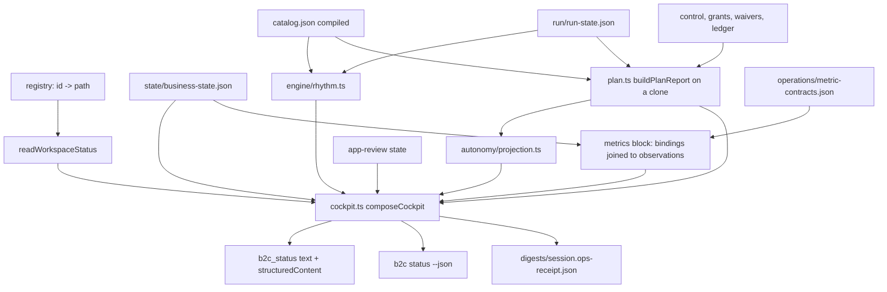
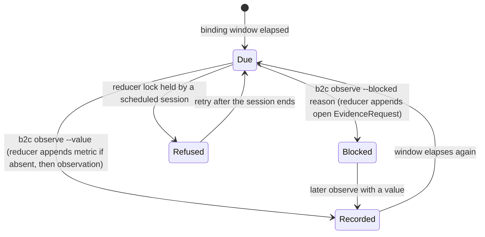
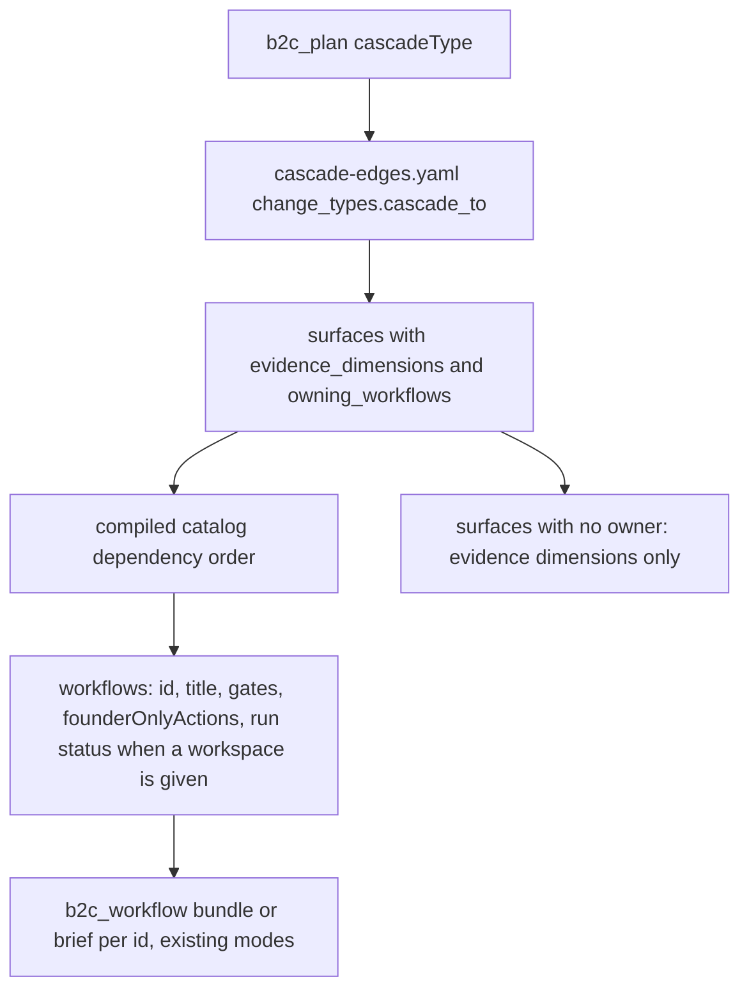

# Operating Cockpit - Plan

## Goal Capsule

- **Objective:** An agent that opens a session against a registered, live consumer app learns from one read where the business stands, what is due this week, which numbers to pull and how, what it may do on its own, and the one decision the founder must make; and every scheduled operating pass leaves a receipt the founder can check instead of trusting prose.
- **Means:** Project the state the engine already owns — reducer-owned business state, the run frontier, the autonomy evaluator, the cascade map, the workspace registry — into `b2c_status`, `b2c_plan`, and the session digest, and add one authored metric-bindings file plus one reducer-owned observation path (KTD1, KTD2, KTD4).
- **Authority hierarchy:** The operator brief of 2026-09-02 ("Operating system with state") is the product contract. This plan is the implementation contract. `AGENTS.md` and `docs/architecture.md` govern where code may live. Issue #29's resolved fork and `docs/authority-envelopes.md` govern tool-surface and authority decisions. On conflict, the brief's asks win on outcome, `AGENTS.md` wins on repository structure, and `docs/authority-envelopes.md` wins on what an agent may claim it can do alone.
- **Stop conditions:** Stop and surface to the user if a change would (a) add an MCP tool name; (b) write run state, control, grants, waivers, or business state anywhere but through the reducer; (c) make the MCP call PostHog, RevenueCat, Sentry, App Store Connect, or Google Play itself; (d) let a portfolio read reach a path the registry does not name; or (e) report a workflow as `autonomous` that the autonomy evaluator would park.
- **Tail ownership:** The primary session owns integration, Git, the version bump, generated renders, and final verification (per `AGENTS.md`). Subagents receive isolated files only.

---

## Product Contract

### Summary

Give `b2c_status` a registered-workspace cockpit that answers "where are we" and "what is due this week"; declare metric bindings once per workspace and let the agent record the numbers it pulls as reducer-owned observations; project authority as three honest buckets; make the scheduled digest carry an ops receipt; answer "what does this change touch" from the cascade map on `b2c_plan`; and roll every registered workspace up into one portfolio read. No new MCP tool names.

### Problem Frame

An agent operator running a live app (engine 0.209.31) reported that the MCP behaves as a library: each session starts by re-deriving phase, lanes, blockers, and due dates, metric pulls are improvised, authority lives in markdown, and there is no way to prove a weekly review happened. The runtime already owns almost all of that state. `state/business-state.json` carries the narrative, phase, lanes, and founder gates; recurring ops nodes reopen every seven days; `check:post-launch` computes the day-7/30/90 checkpoints from `live_since`; the operating model has metric and observation records with source coordinates; grants, waivers, and approval envelopes are evaluated on every dispatch; `b2c_schedule` and `b2c_run` already write a founder-plain digest; `knowledge/process/cascade-edges.yaml` is the machine cascade map; the registry already lists every workspace. None of it is projected into the registered `b2c_status` answer, which today returns run node-status counts and the latest digest, and the operator's machine had no registered workspace at all. The gap is projection and one missing declaration (metric bindings), not storage.

### Key Decisions

- **KD1. Zero net-new MCP tool names; every capability is a mode or facet of an existing tool or a CLI/check surface.** (session-settled: user-directed — chosen over new tools such as `b2c_ops_frontier` or `b2c_cockpit`: one state surface to keep consistent, recorded as issue #29's resolved fork and the prior triage's consolidation.) Governs R1, R10, R13, R17, R20.
- **KD2. The MCP never pulls provider data.** The agent runs its own PostHog, RevenueCat, Sentry, and store MCPs and records the result; the engine owns the definition, the due date, and the receipt. Governs R6, R7, R8.
- **KD3. Verdicts stay with the founder.** Kill/Hold/Fix/Scale, spend, release, pricing, and public voice are never decided by a projection; the cockpit prepares the evidence pack and one question. Governs R11, R14, R15.
- **KD4. Gates are additive this wave.** `check:post-launch` keeps its markdown evidence model; a new gate grades bindings and observations. Reconciling the two evidence models is deferred. Governs R9.
- **KD5. Portfolio rows carry no revenue figure.** (session-settled: user-directed — chosen over adding MRR to the roll-up: RevenueCat is already the founder's revenue view once it is connected, so a second MRR surface adds nothing.) Governs R20.

### Requirements

**Registered cockpit**

- R1. `b2c_status` on a registered workspace returns a cockpit as founder-plain text and as `structuredContent` with `kind: "cockpit"`; the CLI `b2c status --workspace <id-or-path> [--json]` returns the same reader's output.
- R2. The cockpit names the app, its phase, days live and week number from `lanes.post_launch_ops.live_since`, each lane's status with its blockers, the narrative (since last time, right now, your call), the latest digest file, and the onboarding stepper when it applies.
- R3. The cockpit lists founder decisions pending: run-state `waiting_founder` nodes and pending approval ids as the live queue, and migrated `founderGates.pending` entries labeled as carried over, never as a live queue.
- R4. The cockpit lists due and overdue recurring work (every node with `recurrenceDays` whose window elapsed, with days overdue) and the next due checkpoint (launch +7, day 30, day 90) with its due date, plus whether a standing schedule is installed.
- R5. A workspace with no `live_since`, no run state, or unreadable run state returns a degraded cockpit that carries whatever business state is readable, states what is missing, and never errors; the existing five status states stay distinguishable.

**Metric contracts**

- R6. A workspace declares metric bindings once in `operations/metric-contracts.json`, validated against a schema shipped with the skill, covering a fixed canonical set: activation, D7 retention, D30 retention, trial starts, MRR, churn, store conversion, crash-free sessions.
- R7. Each binding names a provider (posthog, revenuecat, app-store-connect, google-play, sentry, manual), a provider-typed pull spec, a comparison rule (window, baseline, flag threshold), and an applicability declaration (applies, or not applicable with a reason).
- R8. `b2c observe` records a measured value, or a dated blocker, for one metric through the reducer as an operating-model observation record (or evidence request) with source coordinates, observation time, producer, and epistemic state; it never writes when the scheduled-session lock is held and says so, and it refuses any free-text argument that matches a credential shape before the reducer is touched.
- R9. `check:metric-contracts` fails a live app (phase_6/6b or post_launch_ops claimed) whose canonical metrics are neither bound nor declared not applicable, whose pull specs hold placeholders, or whose latest observation per bound metric is older than the binding's window; it warns before launch. On a live workspace with no bindings file, a missing file and unbound canonical metrics are warnings while `check:post-launch` passes and errors otherwise; once the file exists, every rule is an error.

**This-week frontier**

- R10. The cockpit carries a "this week" block computed by the same engine pass `b2c_plan` uses, with no writes: the ready batches, held nodes with reasons, and the one founder question.
- R11. The block carries each bound metric's latest observation with its age, the delta against the previous observation, whether the comparison rule flags it, and the pull specs due this week; a ship candidate is named only when a ready node in the post-launch lane produces a user-visible change, otherwise the block says a recorded exception is due.
- R12. Triage items come from the app-review founder projection and lane blockers only; crash and review counts appear only when an observation supplies them.

**Authority projection**

- R13. The cockpit carries, per frontier node, exactly one of `autonomous`, `needs_approval`, `never`, derived from the same evaluator, standing-approval, and approval-requirement paths the runner uses.
- R14. `autonomous` is reported only for a node the frontier already admits for dispatch; a protected node with a standing envelope but no matched recorded action is `needs_approval` with the reason.
- R15. `never` lists the node's founder-only actions and the never-authorize entries, each with the mechanism that enforces it.

**Scheduled receipt**

- R16. Every scheduled session writes, beside its digest, a machine-readable ops receipt naming the session, metric pulls due and recorded (with observation ids and ages), blockers recorded, pulls that were due but recorded neither as an observation nor as a blocker (named as misses), gates run with pass or fail, nodes advanced and parked with reasons, and the founder question; the digest renders the same facts in founder-plain language.

**Cascade query**

- R17. `b2c_plan` accepts a cascade request naming a change type from `knowledge/process/cascade-edges.yaml` and returns the impacted surfaces with their evidence dimensions, the owning workflows in dependency order with their gates and founder-only actions, and the surfaces no workflow owns.
- R18. Surface ownership is authored data in `cascade-edges.yaml`, validated against catalog workflow ids by `check:change-cascade`.
- R19. The cascade response is read-only; recording a cascade still goes through the state `change_cascade` block and `check:change-cascade`.

**Portfolio**

- R20. `b2c_status` with `portfolio: true` (and an optional `workspaces` id list) returns one summary row per registered workspace: id, name, phase, days live, overdue count, founder decisions pending, and a one-line need; the CLI `b2c list --cockpit` prints the same rows.
- R21. A missing path, an incompatible catalog, or unreadable run state degrades that row only and names the cause.

**Cross-cutting**

- R22. Every founder-facing string the cockpit, the receipt, or the digest emits passes the digest's internal-vocabulary blocklist.
- R23. No projection in this plan writes run state, control, grants, waivers, business state, or the registry; `b2c observe` and the scheduled session are the only writers, and both go through the reducer.
- R24. The change ships with a `skill-version.json` bump, release notes, regenerated catalog projections, and a green repo-root `npm run audit:ci`.

### Success Criteria

- An agent with a registered live workspace can answer "app, phase, week, overdue work, pending founder decisions, next checkpoint, numbers to pull" from one `b2c_status` call and zero file reads.
- A scheduled session's receipt lets the founder verify in under a minute what was queried, what changed, which gates passed, and what is parked, without reading the transcript.
- The three authority buckets agree with the runner's actual dispatch decision on every fixture node.
- A cascade query for a known change type returns the impacted surfaces, the owning workflows in order with their gates, and every unowned surface, with no file reads by the agent.
- A portfolio read returns a correct summary row, or a named degraded-cause row, for every registered workspace.
- Registering the skill's reference workspace in a temporary registry and running the cockpit end to end passes in CI as the release gate.

### Scope Boundaries

- The MCP does not call any provider API and does not orchestrate other MCP servers (KD2).
- No new MCP tool names, no new state store, no second reducer, no second router (`AGENTS.md`).
- `check:post-launch` is not rewritten to read observations (KD4).
- Crash and review triage is not fed from Sentry or store APIs; only observations and the existing app-review projection feed triage.
- The hosted worker is untouched; it registers only the four knowledge tools.

#### Deferred to Follow-Up Work

- Reconcile markdown weekly-log rows with observation records in `check:post-launch`, with a rule for disagreement.
- A reducer path that resolves or retires migrated `founderGates.pending` entries.
- Recording observations through a write-gated MCP mode (`B2C_APP_BUILDER_MCP_WRITE=1`); this wave records through the CLI only.
- Structured crash and store-review triage records fed by provider observations.
- Free-text cascade routing ("raise annual price") mapped to a change type; this wave requires the change-type id.

### Acceptance Examples

- AE1. Given a registered workspace live for 41 days whose weekly ops review last succeeded 10 days ago, when the agent calls `b2c_status` with the workspace id, then the cockpit reports week 6, the weekly review 3 days overdue, and the day-30 retro as the next checkpoint marked overdue if its retro row is not completed. Covers R2, R4.
- AE2. Given a binding for D7 retention with a 7-day window and a -10% flag, two observations of 0.34 then 0.29, when the cockpit computes the metrics block, then it reports the latest value, a -14.7% delta, and a flag. Covers R11.
- AE3. Given a scheduled session holds the workspace lock, when the agent runs `b2c observe`, then the command refuses with a message naming the running session and no observation is written. Covers R8.
- AE4. Given a publish-class node whose standing envelope exists but no recorded action matches, when the authority projection runs, then the node is `needs_approval` with the standing-envelope reason, never `autonomous`. Covers R14.
- AE5. Given `cascadeType: "pricing_change"`, when the agent calls `b2c_plan` with the cascade request, then the response lists the surfaces the map cascades to, the owning workflows in dependency order with their gates, and any surface with no owner. Covers R17, R18.
- AE6. Given three registered workspaces where one path is missing, when the agent calls `b2c_status` with `portfolio: true`, then two rows carry cockpit summaries and the third carries the missing-path cause. Covers R20, R21.

### Sources

- Operator brief 2026-09-02, eight asks; corroborated by the 2026-09-01 brief that produced issues #26–#37 (all merged in PRs #57–#66).
- `docs/plans/2026-09-01-1321-feat-founder-zero-wave-1-plan.md` — the prior wave's contract; its R7 ("registered `b2c_status` output is unchanged") is the invariant this plan deliberately supersedes.
- `docs/authority-envelopes.md` — the five grants, the envelope lifecycle, and the never-authorize table this plan projects.
- `knowledge/operations/post-launch-operations.md` §2 (Weekly Ops Review order, cadence rules) and §9 (verdict bands) — the rhythm the cockpit encodes.
- `knowledge/process/change-cascade.md` and `knowledge/process/cascade-edges.yaml` — the surface inventory and change types.
- Runtime anchors: `core/session/status.ts`, `core/session/plan.ts` (`buildPlanReport`, `pickFounderQuestion`), `core/session/stepper.ts` (additive projection pattern), `core/session/digest.ts` (`internalVocabularyBlocklist`), `core/engine/runstate.ts` (`reopenRecurringNodes`), `core/engine/frontier.ts`, `core/autonomy/evaluator.ts`, `core/autonomy/standing-approvals.ts`, `core/operating-model/types.ts`, `core/reducer/cli.ts`, `core/reducer/lock.ts`, `core/adapters/registry.ts`, `core/session/workspaces.ts`, `core/app-review/projection.ts`, `validation/business/operations/check-post-launch-ops.ts`, `validation/business/process/check-change-cascade.ts`.

---

## Planning Contract

### Key Technical Decisions

- KTD1. **One cockpit reader, three consumers.** A new `core/session/cockpit.ts` composes the cockpit from `readWorkspaceStatus`, the loaded business state, the compiled catalog, run state, app-review state, metric bindings, and observations. `b2c_status` (MCP), `b2c status` (CLI), and the scheduled session's receipt all call it, mirroring how `core/session/status.ts` already owns status for CLI and MCP (`docs/architecture.md`, "The interfaces do not implement separate status or workflow rules"). Cites KD1.
- KTD2. **Structured content on the registered branch is a deliberate pin update.** `verification/fixtures/status-degraded.fixtures.ts` and `verification/fixtures/stepper.fixtures.ts` (case i) pin that the `workspace` branch carries no `structuredContent` (the prior wave's R7). This plan supersedes that pin on purpose: the cockpit text is prepended and the existing run-count and digest lines stay verbatim after it, so text consumers keep parsing; the fixtures are updated with the reason recorded in their comments.
- KTD3. **Rhythm math has one owner in core.** Checkpoint due dates (launch +7, day 30, day 90, with the grace days `check-post-launch-ops.ts` uses) and recurring-node due state move into `core/engine/rhythm.ts`; the validator imports them, following `core/schema/evidence-grammar.ts`'s rule that runtime never imports from validation and validators re-export from core. The refactor is behavior-identical and pinned by the existing post-launch fixtures.
- KTD4. **Bindings are authored; observations are reducer-owned.** `operations/metric-contracts.json` is an authored declaration like `operations/agent-operations.json`, graded by a schema shipped in `core/schema/` so a workspace cannot edit the schema that grades it (the `cascade-edges.yaml` trust boundary). Observations append to `operatingModel.records` through `core/reducer/cli.ts`'s commit path, which already enforces append-only mutation. Cites KD2.
- KTD5. **Objective and metric records are upserted lazily from the binding.** Each binding declares its objective inline (id, title, value loop) so nothing has to be invented at write time. The first `b2c observe` for a binding appends, in one patch, the `objective` record when the workspace has none with that id, the `metric` record (status active, pointing at that objective), and the `observation`; a later observe appends only the observation. Nothing else in the repository creates objective records today, and the operating-model validator rejects a dangling objective id, so this is the only way the dogfood gate can pass straight after a plain bootstrap.
- KTD6. **Epistemic state follows the source.** An observation whose source is a provider URL or insight id is recorded `known`; a `manual` provider binding records `inferred`; a blocked pull records an open `EvidenceRequest` with the dated reason and no value. The cockpit shows the blocker where the number would be, matching the runbook's "dated blocker in the cell" rule.
- KTD7. **Lock collisions fail fast.** `b2c observe` acquires the reducer lock with the existing budget; when held it refuses with the running session id and a retry instruction. No retry-budget extension and no cooperative yield for a one-off write.
- KTD8. **The "this week" block reuses `buildPlanReport` without live probes.** The cockpit calls the same compile-evaluate-report path `core/session/plan.ts` runs on a structured clone, so the cockpit and `b2c_plan` cannot disagree about ready, held, or the founder question. One deliberate difference: a status read never spawns a provider probe. `b2c_plan` wires the live Doppler verifier (`core/autonomy/probes/doppler.ts`, which shells out); the cockpit evaluates prerequisites from the probe status and TTL already recorded on each grant, treats an expired or absent record as unverified, and reports which grants it could not verify. The parity fixture compares the two surfaces under the fixture verifier, and a second case shows the cockpit marking a doppler-gated node unverified where `b2c_plan` would probe.
- KTD9. **Authority buckets are derived, never classified.** `core/autonomy/projection.ts` maps the plan report's outcomes: a node in a ready batch is `autonomous`; a held node with reason `founder_approval` or `autonomy` is `needs_approval` with the evaluator's own sentence; a node's compiled approval requirements (from `founderOnlyActions`) and the never-authorize entries are `never`. Standing envelopes are consumed only at dispatch against a recorded action, so the projection never promotes a protected node past what the frontier admitted. Cites KD3 and `docs/authority-envelopes.md`.
- KTD10. **The never-authorize list has one machine owner.** `core/autonomy/never-list.ts` carries the five entries of `docs/authority-envelopes.md`'s table with their enforcement citations; the document links to the module instead of the module restating the document.
- KTD11. **The ops receipt is a sibling file of the digest and the backstop for the pull instruction.** `run.ts`'s `finish()` writes `digests/<session>.ops-receipt.json` next to `digests/<session>.md`, built from the same cockpit reader at session end plus structured per-gate records (`gate`, `pass`, `ranAt`) that `runDeterministicGates` returns alongside its existing evidence strings. A due pull that the worker recorded neither as an observation nor as a blocker appears in the receipt as a named miss, which is what makes the brief-text instruction to call `b2c observe --blocked` checkable rather than trust-only. The digest gains an optional `ops` section rendered like `appReview` and checked against the blocklist.
- KTD12. **Cascade ownership is authored in the map, ordered by the catalog.** `cascade-edges.yaml` surfaces gain `owning_workflows` (catalog workflow ids); the query orders them by the compiled catalog's dependency order and reads gates and founder-only actions from the compiled nodes. `check:change-cascade` validates the ids against the catalog so the map cannot name a workflow that does not exist. Surfaces that name provider-console state and have no owning workflow are returned as unowned with their evidence dimensions.
- KTD13. **Cascade lands on `b2c_plan` as a third request shape.** `{cascadeType, workspace?}` is mutually exclusive with `{workspace}` and `{utterance, cwd}`; the response kind is `cascade`. Bundling the returned workflows uses `b2c_workflow`'s existing bundle and brief modes; nothing is added there. Cites KD1.
- KTD14. **Portfolio is explicit and summary-only.** `b2c_status` requires `portfolio: true` to iterate the registry, accepts an optional `workspaces` id filter, and returns only summary fields (no narrative text, no observation values beyond counts and flags). The registry is a single operator's address book under their home directory, and `b2c list` already enumerates it, so the read widens nothing; the explicit flag keeps an accidental empty call from dumping every business.
- KTD15. **The new write path refuses credential shapes.** `b2c observe` runs its free-text arguments (source uri, source revision, blocked reason) through one shared credential-shape scanner before building a patch, and refuses with the structured `{actionStatus, reasonCode, reason, field}` shape on a match. The shape patterns move into `core/lib/secret-shapes.ts` so the ledger validator's `scanForSecrets()` and the console's `detectSecret()` can share them without `core/` importing from `validation/` or from the console package; an appended record is permanent and the digest can be emailed, so the refusal has to happen before the reducer.

### High-Level Technical Design

Cockpit composition (one read, no writes):

Observation lifecycle (the only new write path):

Cascade query:

### Assumptions

- The canonical metric set in R6 matches what the brief and the runbook name; a workspace can add non-canonical bindings, and the gate ignores them.
- Week number is `floor(daysLive / 7) + 1`; the brief's "week 6" is read as this.
- A binding's window is the freshness bar for its observation (weekly for retention and MRR, daily allowed for crash-free); no relation to a node's `recurrenceDays` is inferred.
- "Ship candidate" is decided by a node-level flag rather than by reading briefs: a ready post-launch node whose compiled `actionClass` is `mutate` or `publish` and whose output paths include an app, store, paywall, or landing artifact qualifies. The exact matching rule is an implementation-time detail recorded in `cockpit.ts`.
- The operator's machine had no registered workspace; the dogfood release gate (Verification Contract) uses the skill's reference workspace in CI and the founder's real app locally.
- Portfolio rows carry counts and flags only; revenue stays in RevenueCat and in each workspace's own cockpit (KD5).

### Open Questions

- Deferred: is this machine ever shared across founders, so that portfolio rows need an ownership scope beyond the explicit id filter? Default: no; the registry is one operator's address book (KTD14).
- Deferred: should `check:post-launch` accept an observation as satisfying a weekly-log cell? Default: not this wave (KD4); the receipt and the runbook row coexist.
- Deferred: does the weekly ops review worker need a standing instruction to call `b2c observe --blocked` when a provider MCP is unavailable headless? Default: yes, added to the node brief text in U5, without a schema change; the ops receipt's named misses (KTD11) are the accountability mechanism when the worker ignores the instruction.
- Deferred: should the cockpit cache a live prerequisite verification across repeated status reads in one MCP process? Default: no; KTD8 reads the recorded probe status and TTL, and only `b2c_plan` probes live.

### System-Wide Impact

- **Cross-interface parity:** `b2c_status` (MCP), `b2c status` (CLI), and the receipt share one reader (KTD1); `b2c_plan` and the cockpit share one frontier pass (KTD8). Fixtures assert both parities.
- **Stable text contract:** the registered `b2c_status` text gains a leading block; the existing lines remain verbatim (KTD2). The prior wave's R7 pin is updated with a recorded reason.
- **Reducer boundary:** one new writer (`b2c observe`), through the existing commit path, append-only.
- **Validator direction:** `check-post-launch-ops.ts` starts importing from `core/engine/rhythm.ts`; runtime never imports validation (KTD3).
- **Knowledge bundle:** edits to `post-launch-operations.md`, `change-cascade.md`, and `cascade-edges.yaml` change the hosted bundle hash; `check:hosted-bundle` and the end-of-wave hosted deploy follow the standing "deploy at the end" directive.
- **Catalog projections:** new gate bindings on the ops workflows and a version bump require `npm run render:all`.

### Risks & Dependencies

- **Pinned text and fixtures:** the R7 pin, the stepper case (i), and the digest fixtures will fail until updated; each update must state the intentional reason in the fixture comment.
- **Founder-gate semantics:** `founderGates.pending` has no reducer path that clears it; the cockpit labels those entries as carried over (R3) so a migrated workspace never shows a stale "live" queue.
- **Provider applicability:** an app with no store IAP or no crash reporting must declare bindings not applicable with a reason, or the gate fails a live app; the reference workspace ships a complete example.
- **First contact for already-live workspaces:** every live app is missing the bindings file on day one; R9's first-contact rule keeps a diligently operated app at warnings until the file exists, so the gate never fails a workspace for adopting the new declaration late.
- **Status-read cost:** the cockpit adds a catalog compile and an evaluator pass to every registered status read; KTD8 keeps provider probes out of that path, and the stepper's cached compile bounds the compile cost.
- **Ordering of cascade workflows:** dependency order from the compiled catalog is stable but may interleave workflows across domains; the response also carries each workflow's domain so an agent can group.
- **Version discipline:** the release commit must be the last commit touching `skill/` and carry at least two release notes and both renders (`check:skill-version`, `check:version-discipline`).

---

## Implementation Units

| U-ID | Title                                                              | Key files                                                                                                                                                              | Depends on |
| ---- | ------------------------------------------------------------------ | ---------------------------------------------------------------------------------------------------------------------------------------------------------------------- | ---------- |
| U1   | Rhythm helper in core                                              | `core/engine/rhythm.ts`, `validation/business/operations/check-post-launch-ops.ts`                                                                                     | —          |
| U2   | Registered cockpit reader and surfaces                             | `core/session/cockpit.ts`, `core/session/status.ts`, `core/mcp/server.ts`, `bin/b2c.mjs`                                                                               | U1         |
| U3   | Metric bindings schema, reference file, gate                       | `core/schema/metric-contracts.schema.json`, `validation/business/operations/check-metric-contracts.ts`, `workspace/business/operations/metric-contracts.json`          | —          |
| U4   | `b2c observe` reducer write path                                   | `core/session/observe.ts`, `core/lib/secret-shapes.ts`, `core/operating-model/validate.ts`, `bin/b2c.mjs`                                                              | U3         |
| U5   | This-week block: frontier, metrics, triage, ship candidate, briefs | `core/session/cockpit.ts`, `core/session/plan.ts`, `core/engine/node-brief.ts`                                                                                         | U2, U3, U4 |
| U6   | Authority projection                                               | `core/autonomy/projection.ts`, `core/autonomy/never-list.ts`, `docs/authority-envelopes.md`                                                                            | U5         |
| U7   | Scheduled digest ops section and receipt file                      | `core/session/digest.ts`, `core/session/run.ts`                                                                                                                        | U5, U6     |
| U8   | Cascade query on `b2c_plan`                                        | `knowledge/process/cascade-edges.yaml`, `core/session/cascade.ts`, `core/session/plan.ts`, `core/mcp/server.ts`, `validation/business/process/check-change-cascade.ts` | —          |
| U9   | Portfolio mode                                                     | `core/session/cockpit.ts`, `core/session/workspaces.ts`, `core/mcp/server.ts`                                                                                          | U2         |
| U10  | Docs, knowledge, catalog render, release                           | `docs/architecture.md`, `docs/validators.md`, `knowledge/operations/post-launch-operations.md`, `catalog/workflows/operations-trust.ts`, `skill-version.json`          | U1–U9      |

All paths below are relative to `skill/b2c-app-builder/` unless they start with `docs/`, `.github/`, or the repo-root `package.json`.

### U1. Rhythm helper in core

- **Goal:** One owner for checkpoint due dates and recurring-node due state that the cockpit, the receipt, and `check:post-launch` all read.
- **Requirements:** R4, R5.
- **Dependencies:** none.
- **Files:** `core/engine/rhythm.ts` (new); `validation/business/operations/check-post-launch-ops.ts` (import the checkpoint math); `verification/fixtures/rhythm.fixtures.ts` (new); `validation/repository/fixtures/lifecycle.fixtures.ts` (existing post-launch fixtures stay green).
- **Approach:**
  1. Move the checkpoint table (launch +7, day 30, day 90), the grace-day constant, `parseLiveDate`, and `checkpointCompletionValid`'s window rule into `core/engine/rhythm.ts` as pure functions over `(liveSince, now, completedDates)` returning each checkpoint's due date, days until or past due, and completion.
  2. Add `recurringDue(plan, run, now)` that mirrors `reopenRecurringNodes`'s elapsed-days rule (KTD3) without mutating run state and returns due and overdue nodes with days overdue and last-done date.
  3. Add `scheduleInstalled(workspacePath)` that reports whether `operations/SCHEDULE.md` exists and whether the scheduled-autonomy node succeeded; the installer node is one-shot and is never listed as recurring.
  4. Re-point `check-post-launch-ops.ts` to the shared functions; keep every issue code and message identical.
- **Patterns to follow:** `core/schema/evidence-grammar.ts` (runtime-owned grammar re-used by a validator); `core/engine/runstate.ts` `reopenRecurringNodes` for the elapsed rule.
- **Test scenarios:**
  - Live since 41 days ago with no completed retro rows: launch +7 and day 30 overdue, day 90 due in 49 days.
  - Live since 41 days ago with a day-30 row dated inside the window: day 30 completed, day 90 next.
  - Empty or future `live_since`: no checkpoints, `liveSince` absent, no throw.
  - A recurring node last finished 10 days ago with `recurrenceDays: 7`: due, 3 days overdue; last finished 3 days ago: not due.
  - A recurring node never run: due since run creation, days overdue computed from `run.createdAt`.
  - The scheduled-autonomy node succeeded and `operations/SCHEDULE.md` exists: schedule installed; either absent: not installed, with which piece is missing.
  - Every existing `check:post-launch` positive and negative fixture still passes unchanged (characterization).
- **Verification:** the post-launch validator fixtures are green with no message changes; the new rhythm fixtures cover each scenario; `npm run typecheck` shows no import from `validation/` inside `core/`.

### U2. Registered cockpit reader and surfaces

- **Goal:** `b2c_status` and `b2c status` answer "where are we" for a registered workspace.
- **Requirements:** R1, R2, R3, R5, R22, R23.
- **Dependencies:** U1.
- **Files:** `core/session/cockpit.ts` (new); `core/session/status.ts` (render and `--json`); `core/mcp/server.ts` (registered branch returns text plus `structuredContent`); `bin/b2c.mjs` (help text); `verification/fixtures/cockpit.fixtures.ts` (new); `verification/fixtures/status-degraded.fixtures.ts` and `verification/fixtures/stepper.fixtures.ts` (deliberate pin updates, KTD2); `verification/fixtures/mcp.fixtures.ts`; `verification/fixtures/cli.fixtures.ts`.
- **Approach:**
  1. `composeCockpit(workspacePath, now)` returns a typed `Cockpit` with `kind: "cockpit"`, `project`, `rhythm` (from U1), `lanes`, `founderDecisions` (live queue from run-state `waiting_founder` nodes and `run.approvals` pending, plus `carriedOver` from `founderGates.pending`), `narrative`, `latestDigest`, `stepper` when present, and a `degraded` list naming what could not be read.
  2. Read business state through the existing loaders in `core/session/run.ts` and run state through `core/engine/runstate.ts`; never write.
  3. `renderCockpit` produces the founder-plain block; the existing `renderWorkspaceStatus` lines follow it verbatim (KTD2). Titles come from the compiled catalog, never node ids; the render is checked against `internalVocabularyBlocklist`.
  4. MCP: the `workspace` branch returns `{ content: [text], structuredContent: cockpit }`; the `check` and `cwd` branches are unchanged.
  5. Update the `b2c_status` tool description in `core/mcp/server.ts` on top of PR #78 (which already removes the "unchanged from before this tool grew a cwd mode" claim): replace the registered branch's "node-status counts and the latest founder digest" sentence with the cockpit and its structured content, drop the "Reads files; runs nothing" claim for that branch, and state that it evaluates the frontier from recorded state without provider probes (KTD8).
  6. CLI: `b2c status --workspace <ref>` prints the text; `--json` prints the cockpit object.
- **Patterns to follow:** `core/session/stepper.ts` (`readWorkspaceStepper`, `withOnboardingStepper`) for a projection that attaches to both surfaces; `core/session/status.ts` `resolveCwdWorkspaceState` for the degraded shape; `core/app-review/projection.ts` for total, founder-plain switches.
- **Test scenarios:**
  - Registered, live, with a run: text starts with the cockpit block and still contains the verbatim run-count and latest-digest lines; `structuredContent.kind` is `cockpit`.
  - Registered, bootstrapped, no run: cockpit carries phase, lanes, narrative; rhythm has checkpoints only when `live_since` is set; `degraded` names "no run yet"; no throw.
  - Registered, run state unreadable: cockpit carries business-state fields, `degraded` names run state, the existing "Run state unreadable" line is preserved.
  - Registered, pre-launch (no `live_since`): no days live, no week, no checkpoints, phase and lanes present.
  - A migrated workspace with two `founderGates.pending` entries and one `waiting_founder` node: live queue has one item with its approval id; carried-over list has two, labeled so.
  - Blocklist: every rendered line passes `internalVocabularyBlocklist`; a fixture injects a node whose title contains "workflow." and asserts the render uses the catalog title, not the id.
  - Parity: CLI `--json` output deep-equals MCP `structuredContent` for the same workspace.
  - Unregistered reference: still refused with the registration command (unchanged).
  - Registry isolation: the fixture sets `B2C_APP_BUILDER_HOME` to a temp dir the way existing MCP fixtures do.
  - Tool description: a fixture reads the registered `b2c_status` description over MCP and asserts it names the cockpit and no longer claims the branch is unchanged.
- **Verification:** the updated R7 pins carry a comment naming this plan and the reason; `npm run test:fixtures` is green; the reference workspace registered in a temp registry renders a cockpit with no `degraded` entries beyond "no run yet".

### U3. Metric bindings schema, reference file, gate

- **Goal:** A workspace declares once how each canonical metric is measured, and a gate fails a live app that has not.
- **Requirements:** R6, R7, R9.
- **Dependencies:** none.
- **Files:** `core/schema/metric-contracts.schema.json` (new); `core/schema/types.ts` and `core/schema/index.ts` (`validateMetricContracts`); `workspace/business/operations/metric-contracts.json` (new reference instance, complete); `workspace/business/operations/README.md` (one line); `validation/business/operations/check-metric-contracts.ts` (new); `package.json` (`check:metric-contracts`); `tooling/lib/audit-plan.ts` (step with `stateArgs`, after `check:post-launch`); `docs/validators.md`; `validation/repository/fixtures/lifecycle.fixtures.ts` (positive and negative fixtures); `catalog/workflows/operations-trust.ts` (add the gate to `post-launch-operations`, `retention-intervention`, `financial-health-review`).
- **Approach:**
  1. Schema: `schemaVersion`, `updatedAt`, `bindings[]`; each binding has `metricId` (canonical enum plus free ids), `objective` (`id`, `title`, `valueLoop` from the operating model's four loops, KTD5), `provider`, `pullSpec` (a `oneOf` keyed by provider: posthog event or funnel steps plus window and cohort; revenuecat entitlement or product ids plus the chart metric; sentry project, environment, release-health field; app-store-connect and google-play report and field; manual instructions), `comparison` (`window`, `baseline: previous_window`, `flagWhen.deltaPct` or `flagWhen.below`), `applicability` (`applies` or `not_applicable` with `reason`), `owner`.
  2. Gate scope guard mirrors `check-post-launch-ops.ts`: errors when live (phase_6/6b or lane claimed), warnings before; issue codes `metric_contracts.file_missing`, `.canonical_unbound.<id>`, `.placeholder.<id>`, `.observation_stale.<id>`, `.observation_missing.<id>`, `.schema_invalid`. First-contact rule (R9): when the file is absent on a live workspace, run the post-launch numbers loop through the shared rhythm helper; if it passes, `file_missing` and `canonical_unbound` are warnings whose fix hint names the reference file, otherwise errors. Once the file exists every rule is an error.
  3. Staleness reads `operatingModel.records` observations by `metricId` and compares `observedAt` to `now` minus the binding window; an open `EvidenceRequest` for the metric dated inside the window counts as a recorded blocker (warning, not error).
  4. Register the gate in the audit plan so `b2c check metric-contracts` resolves its args for free; add the `docs/validators.md` row.
- **Patterns to follow:** `check-post-launch-ops.ts` scope guard and placeholder detection; `workspace/business/operations/agent-operations.json` as the authored-file model; `cascade-edges.yaml` for the skill-shipped schema trust boundary.
- **Test scenarios:**
  - Reference workspace: gate passes (all eight canonical metrics bound or not applicable with a reason).
  - Live app with no file whose weekly log passes `check:post-launch`: one warning, `file_missing`, with the fix hint naming the reference file; the same app with a stale weekly log: one error.
  - Live app with a file missing `store_conversion` and `crash_free_sessions`: two `canonical_unbound` errors.
  - A binding whose objective block lacks a value loop: schema error.
  - Pre-launch app with the same file: the same findings as warnings.
  - A binding whose pull spec holds "TODO" or "<event>": `placeholder` error.
  - A bound metric with an observation 9 days old and a 7-day window: `observation_stale` error; 5 days old: pass.
  - A bound metric with an open evidence request dated 2 days ago and no observation: warning naming the blocker.
  - Not applicable without a reason: schema error.
  - `b2c check metric-contracts --workspace <dir> --json` returns `pass: false` with the structured failures above.
- **Verification:** `check:package-parity` passes with the new step; the validator fixture module reports the new cases; `docs/validators.md` lists the gate; `npm run render:all` reflects the new gate bindings.

### U4. `b2c observe` reducer write path

- **Goal:** The agent records a pulled number, or a dated blocker, as reducer-owned truth in one command.
- **Requirements:** R8, R23.
- **Dependencies:** U3.
- **Files:** `core/session/observe.ts` (new CLI); `core/lib/secret-shapes.ts` (new, KTD15); `validation/business/operations/check-agent-operations.ts` (`scanForSecrets()` imports the shared shapes, behavior-identical); `bin/b2c.mjs` (command table entry `observe`); `core/operating-model/validate.ts` (shape checks for the new fields if any); `core/reducer/cli.ts` (no change expected; the patch goes through `commit`); `verification/fixtures/observe.fixtures.ts` (new); `verification/fixtures/operating-model.fixtures.ts` (append-only proof for observations); `verification/boundaries/producer_never_writes.boundaries.ts` (extend: the cockpit reader never writes); `validation/repository/fixtures/agent-operations.fixtures.ts` (existing secret-scan fixtures stay green).
- **Approach:**
  1. Arguments: `--workspace`, `--metric <id>`, then either `--value <number>` with `--source-uri`, `--source-revision`, optional `--observed-at` (default now), `--confidence lo,hi`, `--independence-group`; or `--blocked "<reason>"`.
  2. Resolve the binding from `operations/metric-contracts.json`; refuse an unbound metric with the structured `{actionStatus, reasonCode, reason, field}` shape `core/session/check.ts` uses.
  3. Scan every free-text argument with the shared credential-shape scanner (KTD15); refuse on a match with the same structured shape, naming the field, before any patch is built.
  4. Build one `StatePatch` targeting `business-state`: append the `objective` record when the binding's objective id is absent, then the `metric` record when none exists for the id (KTD5), then the `observation` (epistemic per KTD6) or an `EvidenceRequest` when blocked.
  5. Acquire the reducer lock through the existing path; on `held`, print the holder session id and exit 1 without writing (KTD7).
  6. Print the appended record ids and the audit entry hash.
- **Patterns to follow:** `core/session/approve.ts` (one write per invocation, attested in the audit log); `core/session/check.ts` structured refusals; `core/reducer/cli.ts` `commit` and `checkOperatingModelMutation`; `check-agent-operations.ts` `scanForSecrets()` for the shapes.
- **Test scenarios:**
  - First observe for D7 with value 0.31 and a provider URL on a freshly bootstrapped workspace: objective, metric, and observation appended in one patch, observation epistemic `known`, the operating-model validator accepts the patch, audit chain verifies.
  - Second observe for the same metric: only an observation appended, objective and metric record counts unchanged.
  - A second binding sharing the first binding's objective id: observe appends only its metric and observation, no duplicate objective.
  - `--blocked` text containing a bearer token or a private-key block: structured refusal naming the field, no write; a plain provider URL with a query string passes.
  - `--source-uri` carrying an API key shape: structured refusal, no write.
  - Observe for a `manual` binding: epistemic `inferred`.
  - `--blocked "PostHog MCP unavailable headless"`: an open evidence request appended, no observation, no value.
  - Unbound metric id: structured refusal, no write, exit 1.
  - Lock held by a fixture session: refusal names the session id, business state byte-identical before and after.
  - Non-numeric `--value`: structured refusal naming the field.
  - Append-only: attempting to observe with an `observedAt` earlier than an existing record still appends (no reorder, no mutation); the mutation check accepts it.
- **Verification:** `npm run test:fixtures` green; `verifyAuditChain` passes on the fixture workspace after three observes; `b2c --help` lists `observe` with one-line usage.

### U5. This-week block: frontier, metrics, triage, ship candidate, briefs

- **Goal:** The cockpit tells the agent what is due, which numbers to pull and how, what moved, what needs a decision, and what to ship.
- **Requirements:** R10, R11, R12, R22.
- **Dependencies:** U2, U3, U4.
- **Files:** `core/session/cockpit.ts`; `core/session/plan.ts` (export a read-only `computePlanReport(workspacePath)` that returns the report and the compiled plan without printing); `core/engine/node-brief.ts` (ops nodes carry due pull specs); `verification/fixtures/cockpit.fixtures.ts`; `verification/fixtures/engine.fixtures.ts` (brief cases).
- **Approach:**
  1. `thisWeek.frontier`: call the exported plan-report path on a structured clone with a verifier that reads recorded probe status and TTL instead of the live Doppler probe (KTD8); carry `batches`, `held` (translated through `translateParkReason`), `founderQuestion`, and `unverifiedGrants`.
  2. `thisWeek.metrics`: join bindings to the latest two observations per metric; compute delta and flag per the comparison rule; list `duePulls` (bound, applies, and stale or never observed) with the pull spec verbatim; list blockers from open evidence requests.
  3. `thisWeek.triage`: app-review founder projection (`summary`, `caseLines`) and lane blockers; counts from observations only when a binding for crashes or reviews exists (R12).
  4. `thisWeek.shipCandidate`: first ready node in the `post_launch_ops` lane that meets the rule in Assumptions; otherwise `null` with the exception text the runbook requires.
  5. Node briefs: when a compiled node is in the `post_launch_ops` lane and has due pulls, `composeNodeBrief` appends a "Pulls due" section listing each spec and the `b2c observe` invocation, plus the standing instruction to record `--blocked` when a provider is unreachable.
- **Patterns to follow:** `core/session/plan.ts` `buildPlanReport` and `pickFounderQuestion`; `core/session/digest.ts` `translateParkReason`; `core/session/run.ts` `finish()` for the app-review fold.
- **Test scenarios:**
  - Covers AE2. Two D7 observations 0.34 then 0.29 with `flagWhen.deltaPct: -10`: delta -14.7%, flagged.
  - One observation only: delta absent, not flagged, age reported.
  - A bound metric never observed: appears in `duePulls` with its pull spec; a not-applicable binding never appears.
  - An open evidence request for MRR: metrics block shows the dated blocker in MRR's slot.
  - Frontier parity: `founderQuestion` and `held` in the cockpit deep-equal the same fields from `b2c_plan` on the same fixture workspace under the fixture verifier.
  - No probes: composing the cockpit on a workspace whose grant declares a doppler prerequisite spawns no child process; the node is held with an "unverified" reason and the grant appears in `unverifiedGrants`, while `b2c_plan` on the same workspace would invoke the verifier.
  - Ship candidate: a ready post-launch node producing `store/APP_STORE_LISTING.md` qualifies; a ready observe-class node does not; no candidate yields the exception text.
  - Triage: an app-review state with a rejection yields the projection's summary and case lines; no app-review state yields an empty triage list, no anomaly.
  - Brief: the weekly ops review brief lists due pulls and the observe invocation; a design node's brief is unchanged.
  - No writes: run state, business state, and control files are byte-identical after composing the cockpit (extend the producer-never-writes boundary suite).
- **Verification:** the cockpit fixture suite covers every scenario; the plan-report export leaves `b2c plan` output byte-identical on the existing fixtures.

### U6. Authority projection

- **Goal:** The agent sees, per frontier node, whether it may act alone, must ask, or must never act, from the same machinery that enforces it.
- **Requirements:** R13, R14, R15.
- **Dependencies:** U5.
- **Files:** `core/autonomy/projection.ts` (new); `core/autonomy/never-list.ts` (new); `core/session/cockpit.ts` (`authority` block); `docs/authority-envelopes.md` (link the never-authorize table to the module); `verification/boundaries/authority-projection.boundaries.ts` (new); `verification/fixtures/cockpit.fixtures.ts`.
- **Approach:**
  1. `projectAuthority(report, plan, control)` maps each node (KTD9): ready batch member → `autonomous`; held with `founder_approval` or `autonomy` → `needs_approval` with the evaluator sentence and reason code; held `blocked` or `upstream` → carried as `waiting` (not an authority bucket) so the three buckets stay honest.
  2. `never` per node: compiled approval requirements' descriptions (the authored `founderOnlyActions`) plus the never-list entries whose category matches the node's `protectedCategory`.
  3. A protected node with an active standing envelope in `operations/agent-operations.json` that has no matched recorded action stays `needs_approval` and carries "a standing envelope may cover this at execution" as context (R14).
  4. The cockpit renders three founder-plain lists: "I can do these now", "These need your yes", "I will never do these alone".
- **Patterns to follow:** `core/autonomy/evaluator.ts` decision details; `core/autonomy/standing-approvals.ts` for what an envelope can and cannot cover; `verification/boundaries/standing-approvals-voice.boundaries.ts` for proving against the real evaluator.
- **Test scenarios:**
  - Covers AE4. A `publish` node tagged for social engagement with a matching standing envelope: `needs_approval`, never `autonomous`.
  - A `mutate` node inside a granted domain with no protected category: `autonomous` and present in a ready batch.
  - A `spend` node with a waiver and funded budget whose approval is already `approved` in run state: `autonomous`; with the approval pending: `needs_approval` naming the approval id.
  - A `release` node: `never` lists "production release outside a version-pinned envelope" with its enforcement citation and the node's founder-only action text.
  - Kill switch engaged: every node is `needs_approval` with the kill-switch sentence; no node is `autonomous`.
  - Boundary: for every node in the engine fixture plan, the projection bucket agrees with `createAutonomyEvaluator`'s decision plus the frontier admission; a deliberately wrong mapping fails the suite.
- **Verification:** the boundary suite runs under `npm run test:boundaries` against the real evaluator; the docs table links to `never-list.ts` and the two agree entry for entry (a fixture reads both).

### U7. Scheduled digest ops section and receipt file

- **Goal:** A scheduled pass leaves proof of what it queried, changed, checked, and parked.
- **Requirements:** R16, R22.
- **Dependencies:** U5, U6.
- **Files:** `core/session/digest.ts` (`DigestInput.ops`, render section); `core/session/run.ts` (`runDeterministicGates` returns structured per-gate records; `finish()` composes the cockpit, writes `digests/<session>.ops-receipt.json`); `core/schema/ops-receipt.schema.json` (new) and `core/schema/index.ts`; `verification/fixtures/session.fixtures.ts` (digest cases); `verification/fixtures/engine.fixtures.ts` (receipt written on every exit path; gate records).
- **Approach:**
  1. Extend `runDeterministicGates` to return, next to its existing `gate:<name>=<outcome>` evidence strings, a structured list of `{gate, pass, ranAt}` records captured at run time; the evidence strings stay byte-identical for existing consumers.
  2. Receipt shape: `sessionId`, `startedAt`, `endedAt`, `outcome`, `rhythm` (due, overdue, next checkpoint), `metrics` (per binding: due, observation id and age, blocker, or `missed` when due and neither was recorded), `gates` (the structured records from step 1), `advanced`, `parked` with reasons, `founderQuestion`, `authority` counts.
  3. Write the receipt on every exit path, including `nothing_to_do` and lock-held outcomes, mirroring the digest's "every exit path writes" rule; on a lock-held outcome the receipt records that no cockpit was composed.
  4. `DigestInput.ops` renders four short lines in founder language: what was due, what got measured, is blocked, or was missed, what passed or failed, what shipped; every line passes the blocklist.
- **Patterns to follow:** `run.ts` `finish()`'s `appReview` fold; `digest.ts` `OUTCOME_HEADLINE` and `translateParkReason`.
- **Test scenarios:**
  - Completed session with one advanced node and one stale metric: receipt has one advanced item, the metric marked due, gates listed with pass, fail, and a run time; digest renders the four lines.
  - A due pull the worker neither observed nor blocked: the receipt marks it `missed` and the digest names it in plain words.
  - Gate records: `runDeterministicGates` returns one structured record per gate with the same pass or fail as its evidence string, and the evidence strings are byte-identical to before.
  - `nothing_to_do` outcome: receipt written with empty advanced and the due pulls still listed.
  - `did_not_run_lock_held`: receipt written with `cockpitComposed: false` and the holder session.
  - A failed gate: receipt `gates[]` carries `pass: false`; the digest line names the check in plain words.
  - Blocklist: the rendered `ops` section passes `internalVocabularyBlocklist` for a fixture whose node ids contain every blocked token.
  - Schema: every receipt written in the fixtures validates against `ops-receipt.schema.json`.
- **Verification:** `verification/fixtures/session.fixtures.ts` digest cases extended and green; a receipt exists beside every digest the engine fixtures produce.

### U8. Cascade query on `b2c_plan`

- **Goal:** "What does this change touch, in what order, with which gates and proof" is one read.
- **Requirements:** R17, R18, R19.
- **Dependencies:** none.
- **Files:** `knowledge/process/cascade-edges.yaml` (`owning_workflows` per surface); `knowledge/process/change-cascade.md` (document the field); `core/session/cascade.ts` (new); `core/session/plan.ts` (`--cascade <type>` CLI form); `core/mcp/server.ts` (`b2c_plan` third request shape, KTD13); `validation/business/process/check-change-cascade.ts` (validate owning ids against the catalog); `validation/repository/fixtures/state-and-meta.fixtures.ts` (map fixtures); `verification/fixtures/mcp.fixtures.ts` and `verification/fixtures/cli.fixtures.ts` (request-shape cases).
- **Approach:**
  1. Author `owning_workflows` for every surface that a catalog workflow produces or consults; leave provider-console surfaces without owners and say so in `change-cascade.md`.
  2. `queryCascade(changeType, options)` loads the map, resolves `cascade_to`, collects owning workflow ids, orders them by the compiled shipped catalog's dependency order (the stepper's cached compile), and reads each node's title, domain, gate ids, founder-only actions, and action class; when `workspace` is given and registered, add each node's run-state status.
  3. Unknown change type: structured refusal listing the valid ids.
  4. MCP: `{cascadeType, workspace?}` is refused together with `utterance` or `cwd`; response `structuredContent.kind` is `cascade`. Update the `b2c_plan` tool description in `core/mcp/server.ts` on top of PR #78 (which already drops the "unchanged" wording) to name the three request shapes.
  5. Validator: `check-change-cascade.ts`'s map loader errors on an owning workflow id absent from `catalog/generated/catalog.json`.
- **Patterns to follow:** `core/mcp/server.ts` `b2c_plan` mutual-exclusion refusals; `kernel/session/stepper.ts` `computeStepper`; `check-change-cascade.ts` map shape checks.
- **Test scenarios:**
  - Covers AE5. `pricing_change`: surfaces match `cascade_to`, owning workflows appear in dependency order, gates and founder-only actions populated, unowned surfaces listed with evidence dimensions.
  - A change type whose surfaces have no owners at all: `workflows` empty, `unownedSurfaces` full, no error.
  - Unknown type: refusal with `fields: ["cascadeType"]` and the valid id list.
  - `cascadeType` with `utterance`: refusal `plan.request_conflict`.
  - With a registered workspace whose owning node succeeded: that entry carries `status: succeeded`.
  - Validator: a map naming a nonexistent workflow id fails with the offending surface and id; the shipped map passes.
  - Existing `b2c_plan` `{workspace}` and `{utterance, cwd}` fixtures unchanged.
  - Tool description: a fixture reads the `b2c_plan` description over MCP and asserts it names the cascade request shape.
- **Verification:** the shipped map passes `check:change-cascade`; the routing fixture suite for `b2c_plan` stays at its measured top-1 accuracy (no scorer change).

### U9. Portfolio mode

- **Goal:** One read across every registered business says which needs attention.
- **Requirements:** R20, R21, R23.
- **Dependencies:** U2.
- **Files:** `core/session/cockpit.ts` (`summarizeCockpit` and `composePortfolio`); `core/session/workspaces.ts` (`list --cockpit`); `core/mcp/server.ts` (`b2c_status` `portfolio` and `workspaces` inputs, KTD14); `bin/b2c.mjs`; `verification/fixtures/cockpit.fixtures.ts`; `verification/fixtures/mcp.fixtures.ts`.
- **Approach:**
  1. `composePortfolio(filterIds?)` iterates `loadRegistry().workspaces`, applies the filter, and for each entry returns `{id, path, row}` where `row` is either a summary (name, phase, days live, overdue count, decisions pending, need line) or a degraded cause (missing path, incompatible catalog, unreadable run state, not bootstrapped).
  2. The need line is the founder question prompt when one exists, else the top overdue item, else "nothing due".
  3. MCP: `portfolio: true` is refused together with `workspace`, `cwd`, or `check`; an unknown id in `workspaces` yields a row with cause `not_registered`, not a refusal.
  4. CLI: `b2c list --cockpit` prints one line per row; plain `b2c list` is unchanged.
- **Patterns to follow:** `core/session/workspaces.ts` `list()` tolerant per-row degradation; `core/session/compatibility.ts` refusal rendering turned into a row cause.
- **Test scenarios:**
  - Covers AE6. Three registered workspaces, one missing path: two summaries, one `missing` row.
  - A workspace pinned to an incompatible catalog: row cause names the pin, other rows unaffected.
  - Filter `workspaces: ["b"]` over three registered: one row.
  - Filter naming an unregistered id: one row with `not_registered`.
  - `portfolio: true` with `workspace`: refusal `status.reference_conflict`.
  - Empty registry: empty rows and the existing "No workspaces registered yet" text.
  - Summary fields only: the row carries no narrative text and no observation values (a fixture asserts the key set).
- **Verification:** the MCP and CLI fixture suites cover the rows; `b2c list` output on the existing fixtures is byte-identical.

### U10. Docs, knowledge, catalog render, release

- **Goal:** The change is documented, projected, versioned, and gated the way this repository requires.
- **Requirements:** R24.
- **Dependencies:** U1–U9.
- **Files:** `docs/architecture.md` (MCP section: cockpit, cascade, portfolio; state ownership: metric bindings authored, observations reducer-owned); `docs/validators.md` (`check:metric-contracts`); `docs/authority-envelopes.md` (never-list link); `knowledge/operations/post-launch-operations.md` (§2 names `b2c_status` as the session opener and `b2c observe` as the recording path; the lane block gains the bindings file); `knowledge/process/change-cascade.md` (`owning_workflows`); `catalog/knowledge/operations/operations-post-launch-operations.yaml` and `catalog/knowledge/process/process-cascade-edges.yaml` (bindings if a new workflow binds); `catalog/workflows/operations-trust.ts` (gate bindings from U3); `catalog/generated/*` via `npm run render:all`; `skill-version.json` (bump with at least two release notes); root and runtime package versions per `CONTRIBUTING.md`; `README.md` if the tool table lists request shapes.
- **Approach:**
  1. Apply doc edits with the STE-style rules `AGENTS.md` sets (`check:documentation-ste100`).
  2. Render, bump, and make the release commit the last commit touching `skill/` (`check:version-discipline`).
  3. Run repo-root `npm run audit:ci` in the main checkout on a detached checkout of the branch, per the standing verification lesson.
- **Test scenarios:** Test expectation: none -- documentation, render, and version metadata; the validators `check:skill-version`, `check:version-discipline`, `check:hosted-bundle`, `check:documentation-ste100`, and `check:learning-grounding` are the proof.
- **Verification:** `npm run audit:ci` reports zero failures from the repo root; `b2c doctor` is green against the installed symlinks.

---

## Verification Contract

| Proof                                      | Command (from `skill/b2c-app-builder` unless noted)                                                                                                                                                                                                                            | Applies to                 |
| ------------------------------------------ | ------------------------------------------------------------------------------------------------------------------------------------------------------------------------------------------------------------------------------------------------------------------------------ | -------------------------- |
| Typecheck and validator fixtures           | `npm run typecheck`, `npm run test:validators`                                                                                                                                                                                                                                 | U1, U3, U8                 |
| Engine, MCP, CLI, digest fixtures          | `npm run test:fixtures`                                                                                                                                                                                                                                                        | U1, U2, U4, U5, U7, U8, U9 |
| Boundary suites against the real evaluator | `npm run test:boundaries`                                                                                                                                                                                                                                                      | U4, U5, U6                 |
| Parity                                     | `npm run test:parity`                                                                                                                                                                                                                                                          | U2, U5                     |
| Named gates on the reference workspace     | `npm run check:metric-contracts`, `npm run check:post-launch`, `npm run check:change-cascade`                                                                                                                                                                                  | U1, U3, U8                 |
| Catalog and renders                        | `npm run check:catalog`, `npm run render:all`, `npm run check:hosted-bundle`                                                                                                                                                                                                   | U3, U8, U10                |
| Repo-root gate                             | `npm run audit:ci` (repo root, main checkout, detached branch checkout)                                                                                                                                                                                                        | all                        |
| Dogfood release gate                       | Register `workspace/business` in a temporary `B2C_APP_BUILDER_HOME`, bootstrap, run one session with the fixture executor, then call `b2c_status`, `b2c observe` twice, `b2c_status` again, and read the receipt; every step succeeds and the cockpit shows the recorded delta | U2–U7                      |

Behavioral skill evaluation: `npm run check:agent-evals` stays green; no routing scorer changes are made, so the routing accuracy fixture keeps its measured top-1.

---

## Definition of Done

**Global**

- Every requirement R1–R24 is traceable to a unit and a passing test scenario.
- No new MCP tool name exists; `core/mcp/server.ts` still registers exactly the twelve names.
- No projection writes; the producer-never-writes boundary suite covers the cockpit reader, the authority projection, the cascade query, and the portfolio read.
- Repo-root `npm run audit:ci` is green, the version bump is the last commit touching `skill/`, and both generated projections are re-rendered.
- Abandoned experiments and dead code from any attempt are removed from the diff.
- The dogfood release gate passes in CI on the reference workspace.

**Per unit**

| Unit | Done when                                                                                       |
| ---- | ----------------------------------------------------------------------------------------------- |
| U1   | Rhythm fixtures pass; post-launch fixtures unchanged; no `validation/` import in `core/`        |
| U2   | Cockpit fixtures pass; R7 pins updated with reason; CLI `--json` equals MCP `structuredContent` |
| U3   | Gate registered, documented, fixture-covered; reference workspace passes                        |
| U4   | `b2c observe` appends through the reducer, refuses on lock, audit chain verifies                |
| U5   | This-week block matches `b2c_plan` on parity fixtures; briefs carry due pulls; no writes        |
| U6   | Boundary suite agrees with the evaluator on every node; docs link the never-list module         |
| U7   | A receipt exists beside every digest on every exit path and validates against its schema        |
| U8   | Shipped map passes the validator; cascade fixtures pass; existing `b2c_plan` shapes unchanged   |
| U9   | Portfolio rows degrade per row; summary key set asserted; `b2c list` unchanged                  |
| U10  | Docs, renders, version, release notes, `audit:ci` green                                         |
