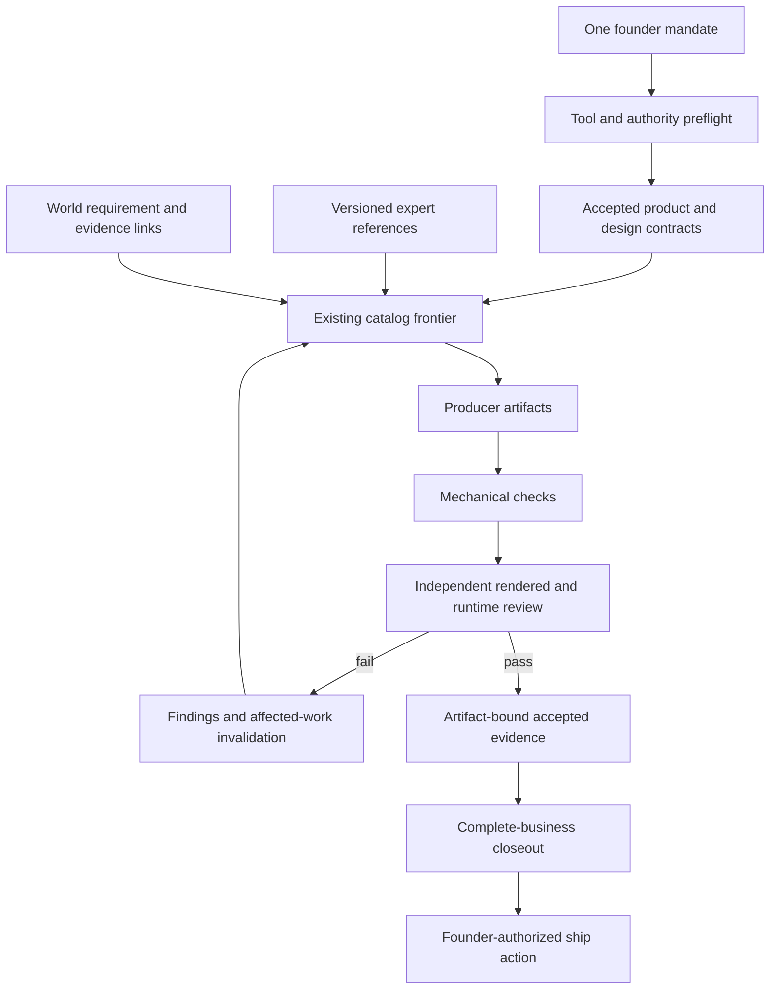
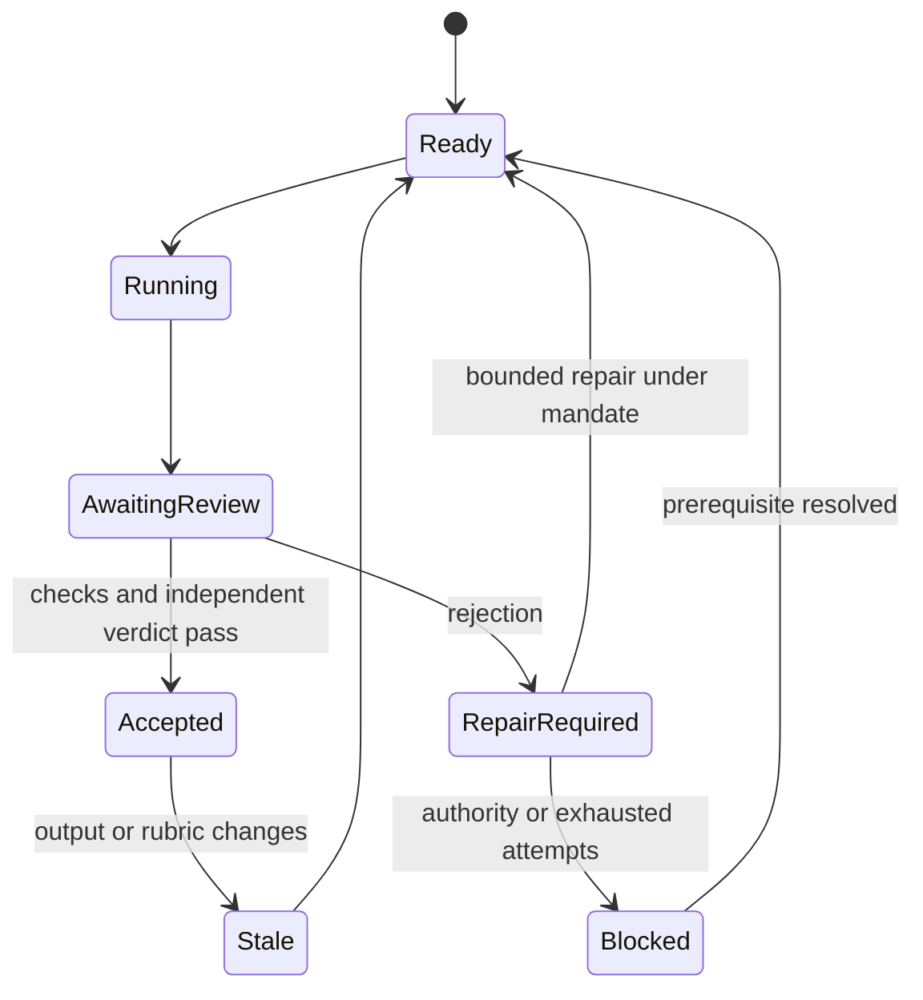

# Complete Consumer Business Delivery - Plan

## Goal Capsule

**Objective:** After connecting the required tools, a founder can make one request and receive a complete consumer app business with exceptional mobile and landing design and the operating systems needed to ship and earn revenue.

**Means:** Strengthen the existing knowledge, catalog, execution, and verification layers (KTD1 through KTD6).

**Authority:** The user's complete-business mandate owns scope. Repository instructions own architecture and protected actions. This plan cannot authorize purchases, credentials, pricing, legal decisions, deployment, store submission, or production release. An existing exact authorization remains valid; do not ask again.

**Execution:** Continue across internal research, implementation, critique, repair, and verification cycles. One shot means one founder mandate carried to its full outcome. Internal iterations do not reduce the deliverable to a pilot or unfinished release.

**Tail ownership:** The primary agent integrates, verifies, and presents a reviewable change. Preserve existing dirty work. The user owns merge and release decisions. Keep the durable goal active until the full outcome has evidence; never treat a passing fixture suite as proof of app quality or business revenue.

---

## Current Scope — Design First

The founder narrowed the mandate on 2026-09-04: perfect the design loop and its actual native and landing implementation; leave other business graph areas as they were. Generic ontology competency expansion, business preflight, operational-readiness, and full-business delivery gates are set aside in a local recovery snapshot. They are not required for this delivery. Keep reference retrieval, independent review, repair, and actual-artifact proof because they directly support design.

The decisive acceptance is a complete, running native-and-landing reference implementation inspected against the named quality bar. TUCK, an offline packing planner, exercises an original shared vector object language, direct manipulation, persistence, editing, undo, repeat use, responsive product proof, and complete accessibility/error states. It is a design reference application, with no claim of store availability or revenue.

Active implementation units: U1 benchmark and harness research; U2/U3 independent judgment, immutable criteria and bounded repair; U5 calibrated native/landing evidence; U7 actual built app, installed binary identity, interaction proof, visual critique, repair, and repository verification. U4/U6 generic graph changes are parked; retrieval coverage from U6 remains in scope.

## Original Product Contract (scope history)

### Summary

Make full delivery executable rather than advisory. Bind knowledge and product decisions to accepted surfaces and runtime proof. Require independent visual and functional evaluation, then repair rejected work under the same mandate. Expose tooling prerequisites and completion evidence through the existing CLI and MCP.

### Problem Frame

The builder has extensive expertise, typed world and work graphs, reference packs, and a durable reducer. Yet mechanical gates can bypass independent judgment, rejected work can remain parked, and full closeout allows blocked or deferred lanes. These gaps let an agent finish the process without producing the business the founder expects.

### Requirements

#### Complete delivery

- R1. One full-business mandate preserves the entire accepted scope until all required deliverables pass. A blocked or deferred required deliverable is incomplete.
- R2. The delivery covers landing and funnel, mobile first value and repeat use, backend and data lifecycle, monetization and entitlement recovery, analytics, lifecycle and support, security and privacy, growth assets, store readiness, and operations applicable to the chosen business.
- R3. Resolve required tools, accounts, projects, capabilities, and permissions before dependent work. Missing connections produce exact actionable prerequisites; tool presence never proves permission or live operation.
- R4. Preserve protected-action gates and accurate claim levels: built, locally verified, provider verified, store ready, submitted, and released cannot substitute for one another. Ready to earn revenue requires working purchase and entitlement behavior; revenue itself requires observed transactions.

#### Craft and evidence

- R5. Research Airbnb, Duolingo, grug, Blippo+, Metaballs, Is This Seat Taken?, Hearing Buddy, and Structured from primary sources, identifying what transfers to a new product and what is reference-specific.
- R6. Evaluate mobile and landing separately against frozen, reference-calibrated criteria for coherence, originality, craft, functionality, accessibility, motion, and cross-surface identity. A strong average cannot hide a failed criterion or missing surface.
- R7. Independent reviewers inspect current rendered artifacts and interactions. Bind their verdicts to the exact producer outputs, rubric, reviewer identity, target platform, and evidence; stale or self-authored acceptance cannot pass.
- R8. A rejected review returns actionable findings to the responsible producer, invalidates affected downstream acceptance, and requires fresh review after repair. Interruption and bounded retry exhaustion must preserve the mandate and never imply completion.

#### Graph and runtime integrity

- R9. Keep the world ontology, work vocabulary, agent phase overlay, expert reference library, and reducer execution state distinct. Extend the existing layers without a second router, planner, graph database, or state store.
- R10. Make competency questions executable where they affect delivery: accepted requirements must connect to journeys, surfaces, implementation, and current proof; evidence must carry provenance and cannot silently conceal contradictions.
- R11. Retrieval must preserve critical reference coverage under a bounded context budget, report missing coverage, and retain source freshness and hashes through CLI/MCP briefs.
- R12. Verify the full claim with real local mobile and web execution and independent visual review, plus provider-native evidence for provider claims. Synthetic fixtures prove safety and behavior of the builder, not the quality of generated businesses.

### Acceptance Examples

- AE1. Covers R1, R4. All documents exist but payment recovery or required mobile states are missing: full closeout fails and identifies the unfinished work.
- AE2. Covers R6, R7. Landing scores well but mobile has no capture: design acceptance fails. Changing an accepted screenshot or rubric invalidates the prior review.
- AE3. Covers R7, R8. Mechanical checks pass and the independent reviewer rejects: the node stays unaccepted, the producer receives findings, and repaired output receives a new review.
- AE4. Covers R3, R4. A tool is installed but the chosen provider project cannot be read: dependent live work is blocked with the exact connection need. Authorized local work continues.
- AE5. Covers R10, R11. A required journey lacks evidence or the reference budget excludes mandatory guidance: the agent receives a coverage gap instead of a complete-looking result.

---

## Planning Contract

### Key Technical Decisions

- KTD1. Keep the existing typed graphs and BM25 retrieval. Add executable relationship coverage and traceable provenance through their current projection boundaries. W3C SHACL supports shape validation, but shape validity alone cannot answer whether the delivered product satisfies a requirement. Governs R9, R10, R11.
- KTD2. Mechanical checks and independent judgment are conjunctive requirements. Preserve the public verification kind where possible and enforce the fresh-context policy in shared runtime acceptance. The current compile precedence incorrectly treats gates as sufficient. Governs R7, R8.
- KTD3. Use artifact-bound review evidence and existing run-state transitions for repair. Retain fingerprint invalidation and reducer ownership; add no parallel acceptance store. Governs R7, R8.
- KTD4. Extend the existing full-launch workflow with a strict complete-business acceptance contract and gate. Ordinary in-progress orchestration may record pending reviews; full closeout requires every applicable review to pass. Governs R1 through R4.
- KTD5. Extend the existing reference-pack and design-grading system with mobile and landing coverage, calibrated hard criterion floors, and current artifact proofs. Keep reference-specific visual identities out of generic templates. Governs R5 through R7.
- KTD6. Prove orchestration contracts with adversarial fixtures, then run the real builder against a complete representative business. Keep observed model output and provider evidence separate from fixtures. Governs R12.

### High-Level Technical Design

### Research That Changes the Implementation

- [Anthropic: Harness design for long-running application development, 2026-03-24](https://www.anthropic.com/engineering/harness-design-long-running-apps): independent evaluation of running applications, calibration, hard criterion thresholds, and repair inform KTD2, KTD3, and KTD5. This supports internal iteration under one instruction; it does not establish guaranteed visual excellence or revenue.
- [W3C SHACL](https://www.w3.org/TR/shacl/): shape and constraint validation informs KTD1; executable competency coverage remains a separate behavior to prove.
- [Apple Design Awards](https://developer.apple.com/design/awards/): current official identities and platform distinctions ground R5. The examples span mobile, desktop, games, and spatial interaction; transfer principles, not a single aesthetic.
- `core/engine/compile.ts`, `core/session/run.ts`, and `core/engine/runstate.ts`: verification selection and acceptance are the enforcement seam for KTD2.
- `core/session/executor.ts`: directory inputs currently reach a regular-file-only receipt hasher; design review cannot reliably execute until this is corrected.
- `catalog/workflows/operating-system.ts` and `validation/business/orchestration/check-parallel-orchestration.ts`: existing closeout and review-ledger checks are the extension points for KTD4.

### Assumptions and Implementation Discoveries

The task improves this builder rather than choosing and launching a new commercial venture without a founder mandate. A representative generated business is verification of builder capability. The test business must retain full scope and cannot stand in for all categories or guarantee commercial performance.

Exact provider capability and native-device availability are execution-time facts. Inspect them without exposing secrets or changing accounts. Use the supported Node.js 22 runtime. Preserve all pre-existing repository modifications and Planes timeout material.

---

## Implementation Units

### U1. Source-backed graph and craft expertise

**Goal:** Make the researched principles available through the existing knowledge graph and workflows.

**Requirements:** R5, R6, R9; KTD1, KTD5.

**Dependencies:** None.

**Files:** `knowledge/orchestration/full-launch-program.md`, `knowledge/design/`, corresponding `catalog/knowledge/` manifests, `docs/research/2026-09-04-graph-and-craft-audit.md`, and affected routing knowledge under `skill/b2c-app-builder/`.

**Approach:** Record primary-source provenance and the repo gap matrix. Extend reference-pack instructions and remove quality downgrade rules that conflict with a complete-business mandate. Bind narrowly to relevant workflows.

**Test scenarios:** Confirm each added reference is retrievable and catalog-bound; validate source metadata and links. Test expectation for research prose: no isolated unit tests.

**Verification:** Research covers every named exemplar, distinguishes visual inspection from source descriptions, and maps findings to executable changes.

### U2. Conjunctive verification and real reviewer inputs

**Goal:** Prevent mechanical gates from bypassing required independent review.

**Requirements:** R7; AE3; KTD2.

**Dependencies:** None.

**Files:** `core/engine/compile.ts`, `core/engine/runstate.ts`, `core/engine/verification.ts`, `core/session/run.ts`, `core/session/verify.ts`, `core/session/executor.ts`, brief projections, relevant shared schemas, `verification/fixtures/engine.fixtures.ts`, `verification/fixtures/session.fixtures.ts`, and `verification/fixtures/hosted-knowledge.fixtures.ts`, under `skill/b2c-app-builder/`.

**Approach:** Use one shared independent-review predicate in pending selection, acceptance, verifier sweeps, CLI verification, and briefs. Persist mechanical evidence for the current attempt before admitting independent acceptance. Resolve required directory inputs into bounded canonical file evidence without following unsafe links.

**Test scenarios:**

1. Mechanical success plus rejection never accepts.
2. Independent acceptance plus a failing mechanical gate never accepts.
3. Same producer and verifier identity fails; a distinct verifier succeeds only for current fingerprints.
4. A real design audit brief with reference-pack directories dispatches successfully, and file mutation invalidates its receipt.
5. Non-judgment nodes retain deterministic behavior and hosted briefs remain consistent.

**Verification:** Focused runtime and parity fixtures demonstrate both branches and the real CLI-input boundary.

### U3. Artifact-bound review and durable repair

**Goal:** Carry rejected work through repair and re-review without a new user prompt.

**Requirements:** R7, R8; AE2, AE3; KTD3.

**Dependencies:** U2.

**Files:** Existing engine run-state, node brief, session runtime, verification schemas, `verification/fixtures/engine.fixtures.ts`, `verification/fixtures/session.fixtures.ts`, and `verification/fixtures/adapters.fixtures.ts`.

**Approach:** Bind findings to producer and rubric fingerprints. Reuse existing stale propagation and attempt history for bounded repair. Reconcile catalog upgrades by stable workflow ID while preserving attempts and authority history. Retain acceptance only when its evidence satisfies the current contract; lane status without bound evidence requires fresh verification. Distinguish retryable quality failure, missing authority, and exhausted attempts.

**Test scenarios:**

1. Reject, repair, fresh review, and acceptance complete under one session mandate.
2. A changed producer output or rubric invalidates acceptance and dependents.
3. Interrupted repair resumes correctly and does not replay protected actions.
4. Exhausted retries remain incomplete with useful findings.
5. A catalog upgrade preserves interrupted repair and rejects acceptance without current producer, rubric, and gate evidence.

**Verification:** Durable session integration proves the loop rather than testing transition helpers alone.

### U4. Complete-business preflight and closeout — parked by founder scope

**Goal:** Refuse full-business completion when required products or operations are unfinished.

**Requirements:** R1 through R4; AE1, AE4; KTD4.

**Dependencies:** U2, U3.

**Files:** `catalog/workflows/operating-system.ts`, `catalog/gates/`, `validation/business/orchestration/check-parallel-orchestration.ts`, a complete-business gate in that directory, existing operator/provider contract readers, `validation/repository/run-validator-fixtures.ts`, fixture workspaces, and `verification/fixtures/catalog.fixtures.ts`.

**Approach:** Derive required deliverables and review pairs from existing catalog and accepted scope. Keep preflight read-only. Enforce current implementation, review, native, funnel, provider, revenue, and operational evidence at closeout. Report exact unmet requirements through CLI/MCP.

**Test scenarios:**

1. Missing mobile, landing, backend, payment recovery, analytics, or support evidence fails full closeout.
2. Blocked/deferred required lanes and missing catalog review pairs cannot count as complete.
3. Pending reviews are valid during work but invalid at closeout.
4. A tool installed without scoped provider readback cannot establish connection readiness.
5. Valid complete evidence passes at its truthful claim level; release remains separately authorized.

**Verification:** Adversarial fixtures and real workspace gate output identify actual missing surfaces without accepting prose placeholders.

### U5. Calibrated mobile and landing craft gate

**Goal:** Make visual quality observable and consequential in acceptance.

**Requirements:** R5, R6, R7; AE2; KTD5.

**Dependencies:** U1, U2.

**Files:** `tooling/grade-design-surface.ts`, `validation/business/design/`, design reference schemas and knowledge, relevant catalog gates/workflows, `verification/fixtures/` and validator fixtures, under `skill/b2c-app-builder/`.

**Approach:** Extend the current grading contract with required native and landing surfaces, reference calibration, immutable capture identities, interaction coverage, criterion floors, and blocker findings. Keep heuristic lint separate from independent judgment.

**Test scenarios:**

1. Missing native capture fails even with a strong landing score.
2. One failing criterion fails despite a high average.
3. Missing interactions, stale capture hashes, self-review, and missing rubric calibration fail.
4. Valid platform-specific coverage passes without prescribing a universal visual style.

**Verification:** Inspect real rendered outputs and capture artifacts; deterministic validation confirms evidence integrity but does not award taste scores.

### U6. Executable competency coverage — parked; design retrieval coverage retained

**Goal:** Connect requirements and critical guidance to the work and proof that satisfy them.

**Requirements:** R9, R10, R11; AE5; KTD1.

**Dependencies:** U1, U4, U5.

**Files:** Existing `catalog/ontology/` types, instance validation and product projection; `core/knowledge-service/service.ts`; `verification/fixtures/ontology.fixtures.ts`, `product-instance.fixtures.ts`, `knowledge.fixtures.ts`, and `hosted-knowledge.fixtures.ts`.

**Approach:** Extend authored product relationships and generated projections at their existing owners. Add executable coverage queries and explicit reference-budget coverage. Preserve stable IDs and provenance.

**Test scenarios:**

1. Required journey without implementation or current proof fails competency coverage.
2. Dangling, contradicted, or stale evidence cannot satisfy a requirement.
3. Low retrieval budgets report omitted mandatory guidance instead of silently dropping it.
4. CLI/MCP results preserve identical reference IDs, hashes, and coverage results.

**Verification:** Semantic fixture questions are answered from real instance relations, and representative business queries retrieve their critical references within budget.

### U7. Integrated proof and delivery

**Goal:** Demonstrate the builder's complete delivery behavior and expose any remaining gap honestly.

**Requirements:** R1 through R12; KTD6.

**Dependencies:** U1 through U6.

**Files:** Package metadata and lockfiles, generated projections, source freshness records, relevant `verification/` scenarios and benchmark definitions, public routing docs, and a dated evidence report in `docs/verification/`.

**Approach:** Render affected projections and run focused then broader gates. Run a representative full business from a single mandate through local native and web execution, independent review, repair, and complete closeout. Capture provider evidence only within existing authority. Review and simplify the final change.

**Test scenarios:**

1. Baseline shortcuts fail the strengthened gates.
2. One mandate survives review failure and interruption while retaining all business deliverables.
3. Real web and native interactions demonstrate acquisition, first value, repeat use, and applicable purchase/recovery.
4. Missing provider or physical-device proof remains visible and cannot be replaced by fixture evidence.

**Verification:** The evidence report maps every requirement to current code, test, capture, runtime, and provider evidence, and identifies incomplete requirements without marking the goal achieved.

---

## Verification Contract

Use Node.js 22 and install locked dependencies with `npm ci` at the root and runtime package. Verify CLI help and doctor. During work use focused fixture filters and relevant validators. After integration run `npm run render:all`, `npm run validate:skill`, `npm run check:catalog`, `npm run check:package-parity`, `npm run test:fixtures`, `npm run test:validators`, `npm run test:boundaries`, and `npm run audit:ci` where the repository contract applies.

Inspect the assertions behind each pass. Inspect generated briefs, actual captures, real user interactions, and any provider-native results separately. Never count LaunchBench scenario declarations as a live generation run. A benchmark with missing evidence remains incomplete.

---

## Definition of Done

Every R requirement and AE example has authoritative evidence at its stated scope. Each U unit is implemented, integrated, and checked. New instructions are reachable through the thin router and manifest-backed references. Generated projections and package metadata agree. Abandoned experimental code is removed while unrelated user work is preserved.

The final report explains what the builder demonstrably produces, what was visually and functionally inspected, and any unmet prerequisite. Research and green checks alone cannot prove the complete-business promise. Unverified required outcomes keep the durable goal active.

## Design Completion Requirements

- D1. Research the eight named benchmarks from primary sources. Transfer product-relevant principles, not their branding.
- D2. Freeze product-specific criteria and visual reference evidence before judging the implementation; evaluate every facet independently.
- D3. Produce a complete native iOS app and responsive landing from one accepted design. Share original object geometry, typography, colors, hierarchy, and interaction meaning.
- D4. Exercise creation, editing, direct-manipulation packing, undo, completion, relaunch persistence, reuse/export, malformed import/recovery, and accessible equivalents.
- D5. Inspect actual screenshots and interactions on native, mobile web, and desktop web. Handle reduced motion, large text, screen-reader/keyboard operation, and no-JavaScript web fallback.
- D6. Reviewers remain independent of production. Reject with actionable findings, repair through the same mandate, recapture, and re-review without weakening the rubric.
- D7. Bind review to current sources, inputs, assets, rubrics, and exact built/installed app; stale or incomplete evidence cannot pass.
- D8. Feed implementation findings back into the catalog, expertise, and workflow. Prove the loop with runtime tests and visual evidence, not prose claims alone.

A reference implementation can demonstrate the design loop's capability. It cannot prove that all future outputs will be excellent. Report what was actually inspected and any remaining failure against D1-D8.
