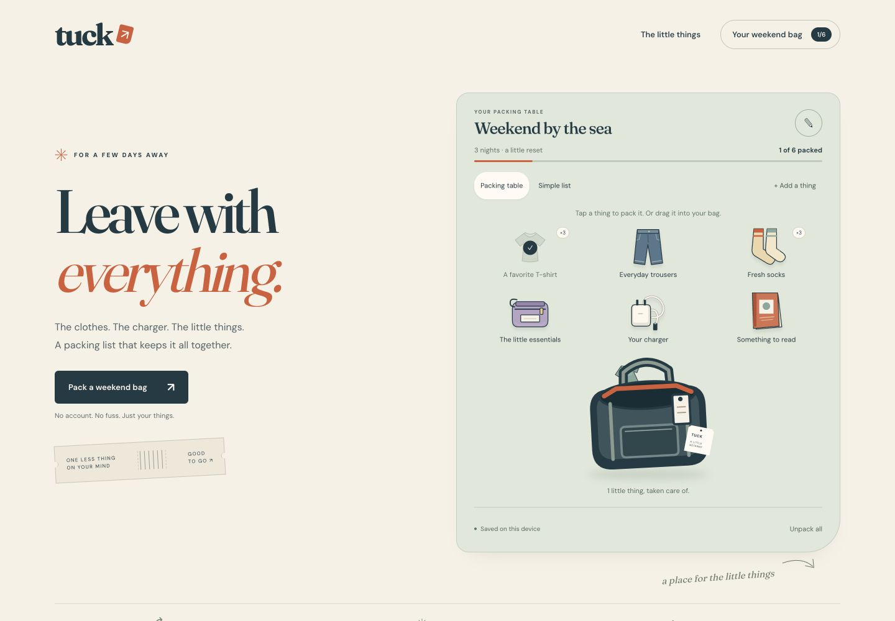
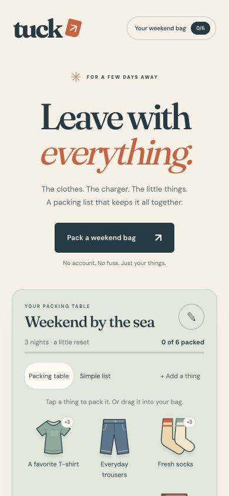
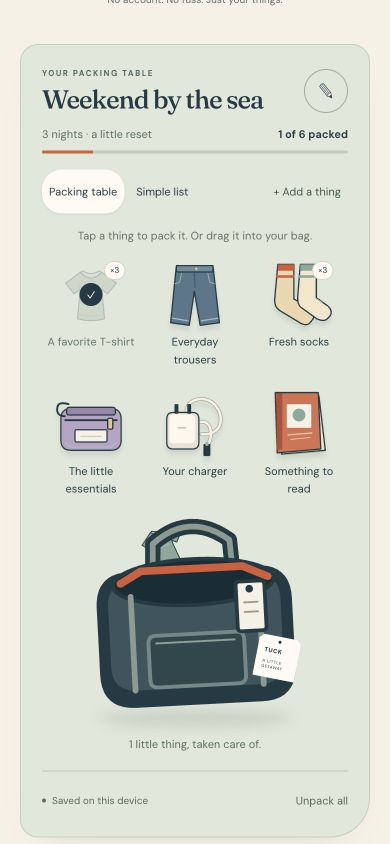
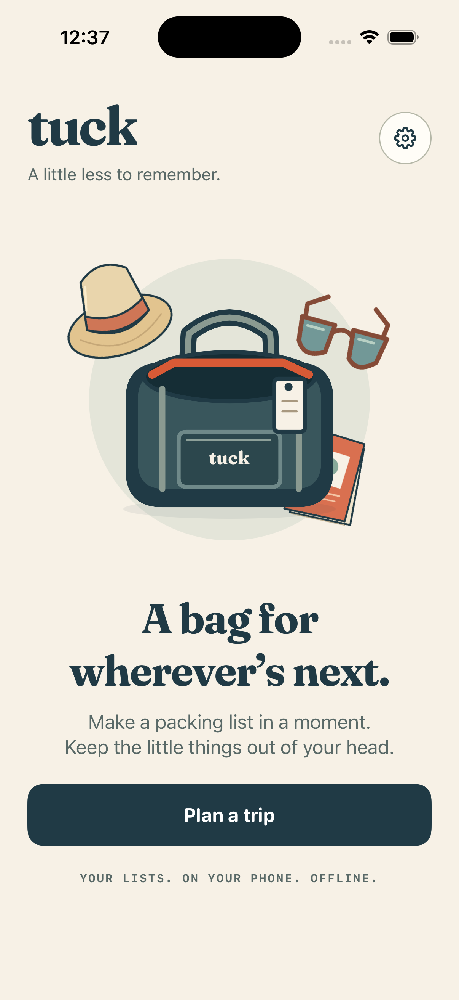
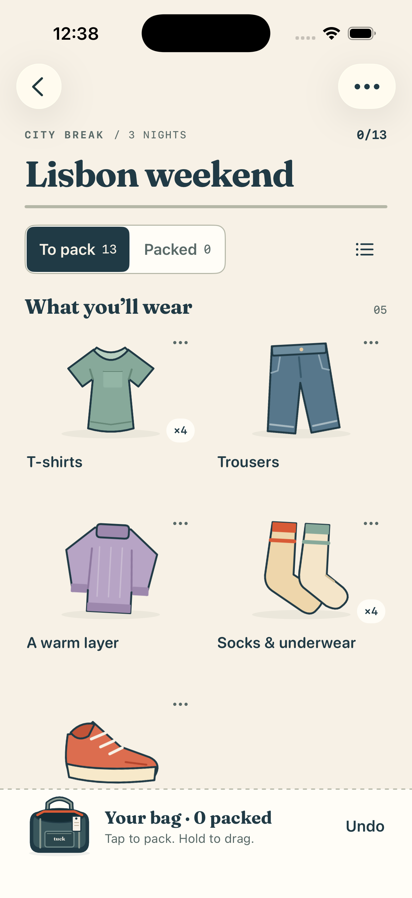
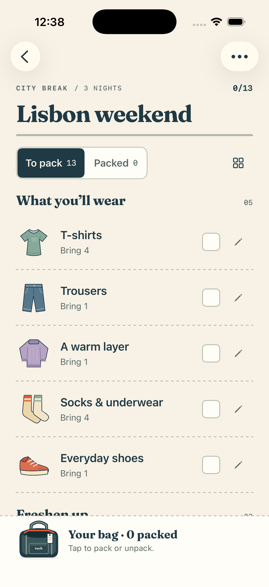

# Tuck · Leave with everything.

An offline iPhone packing planner and responsive web experience. Plan a trip,
choose what to bring, and pack by tapping an item or dropping it into the bag.
The same original illustrations, type, and colors carry through both surfaces.

## The web experience

The landing page puts a working packing table beside the product promise.



| A clear first step | A bag you can pack in the browser |
| --- | --- |
|  |  |

## The iPhone app

The bag appears in the first-use screen and stays within reach while packing.
An illustrated grid and a compact list support the same task.

| Start a trip | Pack your things | Use a checklist |
| --- | --- | --- |
|  |  |  |

These are original browser and iOS simulator screenshots from September 4, 2026.
They show the visual work delivered in those runs. Native screenshots precede
later accessibility repairs. The [capture manifest](showcase/manifest.json)
records the original filenames, dimensions, and SHA-256 hashes. No source
fingerprint was retained for these captures, so they do not certify the current
build or satisfy the independent design acceptance gate.

## Explore the implementation

- [Product contract](product.yaml) and [rendered product scope](PRODUCT.md): the promise, journeys, and accepted requirements.
- [Design system](DESIGN.md): shared identity, platform decisions, and screen contracts.
- [Native app](native/README.md): SwiftUI implementation, persistence, recovery, and simulator commands.
- [Web implementation](landing/): responsive page with local storage, editing, import, export, and undo.
- [Shared artwork](shared/object-geometry.json): original vector paths used by both implementations.
- [Behavior checks](tests/README.md) and [verification requirements](VERIFICATION.md): recorded observations and the evidence still needed.

To try the web experience, serve this directory from the repository root:

```sh
python3 -m http.server 4179 --bind 127.0.0.1 --directory examples/tuck
```

Open [the local packing page](http://127.0.0.1:4179/landing/). The browser stores
its bag on this local origin. Native build and test instructions are in the
[native guide](native/README.md).

Tuck demonstrates product and design execution for an offline utility. Its
accepted scope excludes purchases and subscriptions. Full design acceptance,
physical-device VoiceOver evidence, store distribution, and business results
remain unproven; this example does not establish whole-business completion.
